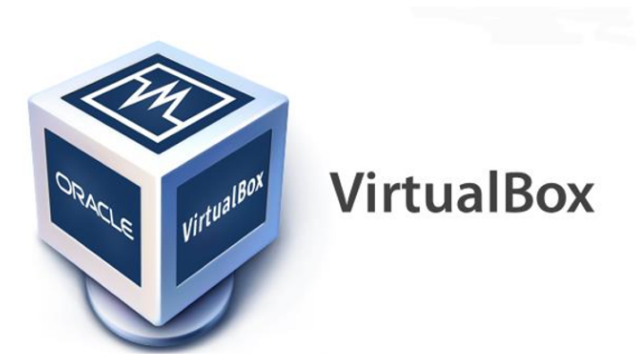
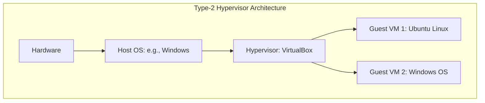
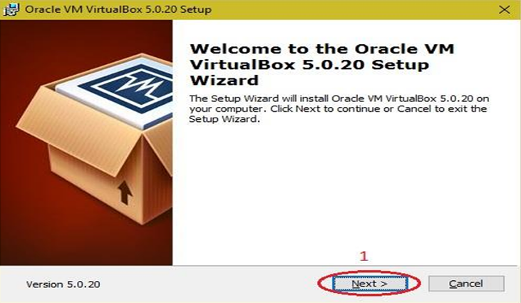
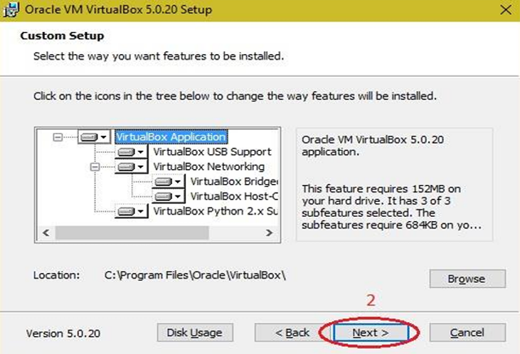
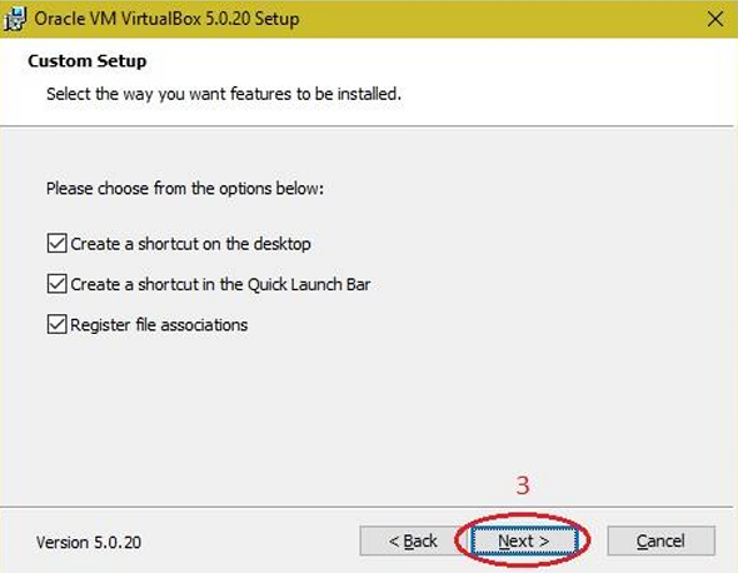
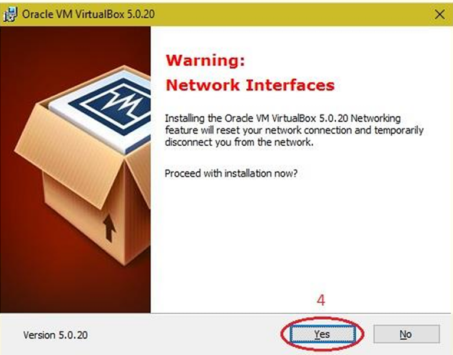
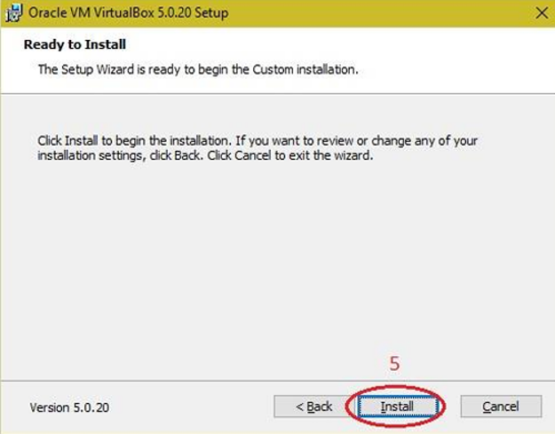

| Option | Value |
| :--- | :--- |
| **Prerequisites** | A 64-bit host computer, VirtualBox installer, Ubuntu Desktop ISO image |
| **Estimated Time**| 45 minutes |
| **Technology** | Oracle VM VirtualBox, Linux (Ubuntu Desktop/Server) |

---

## 🎯 Aim
To download, install, and configure a Type-2 hypervisor (Oracle VM VirtualBox) and install a guest Linux Operating System (Ubuntu) on top of a Windows host machine.

---

## 📖 Theoretical Background

### Virtualization
Virtualization is the process of creating a software-based (virtual) representation of something physical, such as virtual applications, servers, storage, and networks. It is the core technology powering cloud computing.

### Hypervisor
A **hypervisor** (or Virtual Machine Monitor, VMM) is software that creates and runs virtual machines (VMs). 
* **Type-1 (Bare-Metal)**: Runs directly on the host's hardware (e.g., VMware ESXi, Microsoft Hyper-V).
* **Type-2 (Hosted)**: Runs as an application on top of an existing Operating System (e.g., VirtualBox, VMware Workstation). This lab uses VirtualBox, a Type-2 hypervisor.

---

## 🛠️ Requirements & Setup
1. **VirtualBox Installer**: Download from the official [VirtualBox Downloads Page](https://www.virtualbox.org/wiki/Downloads) (Select *Windows hosts*).
2. **Guest OS ISO**: Download the [Ubuntu Desktop LTS ISO](https://ubuntu.com/download/desktop).

---

## 🚶 Step-by-Step Procedure

### Phase A: Installing Oracle VM VirtualBox
1. Double-click the downloaded VirtualBox installer executable. On the **Welcome to the Oracle VM VirtualBox Setup Wizard** screen, click **Next**.
   
   

2. Keep the default installation features and path unchanged, then click **Next**.
   
   

3. Review the shortcut preferences and settings, and click **Next**.
   
   

4. A warning about **Network Interfaces** will appear (temporary disconnect during virtual interface setup). Click **Yes** to proceed.
   
   

5. Click **Install** to begin the installation process.
   
   

6. Once the installation is complete, click **Finish**. The VirtualBox shortcut icon will now appear on your desktop.
   
   

---

### Phase B: Creating a New Virtual Machine
1. Open VirtualBox and click the **New** button (Blue Ribbon icon) at the top.
2. In the **Create Virtual Machine** dialog, configure the following details:
   - **Name**: `Ubuntu-Lab`
   - **Folder**: Select the location to store VM files (default is usually fine).
   - **ISO Image**: Browse and select the downloaded Ubuntu ISO file.
   - **Type**: `Linux`
   - **Version**: `Ubuntu (64-bit)`
   - *Optional:* You can check **Skip unattended installation** if you want to manually run through the OS setup screens. Click **Next**.
3. **Hardware Configuration**:
   - **Base Memory (RAM)**: Allocate at least `2048 MB` (2 GB) or `4099 MB` (4 GB) if your host system allows.
   - **Processors**: Assign at least `2 CPUs`. Click **Next**.
4. **Virtual Hard disk**:
   - Select **Create a Virtual Hard Disk Now**.
   - Allocate at least `25 GB` of disk size (dynamically allocated is default and recommended). Click **Next**.
5. Review the summary and click **Finish**.

### Phase C: Installing the Guest OS (Ubuntu)
1. Select your new VM from the left panel and click **Start** (Green arrow).
2. The VM will boot from the ISO. In the GRUB menu, select **Try or Install Ubuntu** and hit Enter.
3. Once the installer loads, select your preferred language and click **Install Ubuntu**.
4. Choose keyboard layout (Default: English US) and click **Continue**.
5. Select **Normal Installation** and check **Download updates while installing Ubuntu**. Click **Continue**.
6. Select **Erase disk and install Ubuntu** (This only erases the virtual hard disk created in Phase B, not your Windows drive). Click **Install Now** and confirm the write changes dialog.
7. Choose your timezone and click **Continue**.
8. Set up your user credentials:
   - **Your Name**: `Lab Student`
   - **Computer Name**: `ubuntu-vm`
   - **Username**: `student`
   - **Password**: Set a secure password.
9. Click **Continue** and wait for the installation to complete.
10. Once prompted, click **Restart Now** and press Enter when asked to remove the installation medium.

---

## 🧪 Expected Output & Verification
- Upon restart, the Ubuntu login screen will load.
- Log in with the password you configured.
- Open a web browser or terminal (`Ctrl` + `Alt` + `T`) inside the virtual machine to verify internet connectivity.

