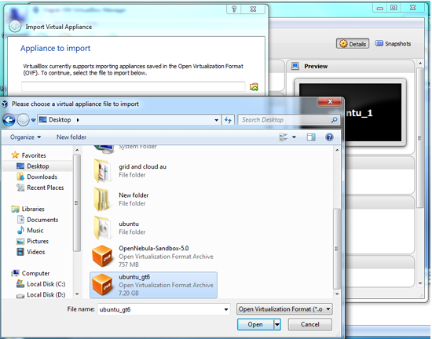
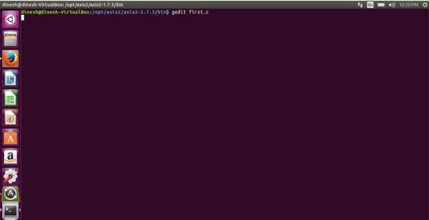
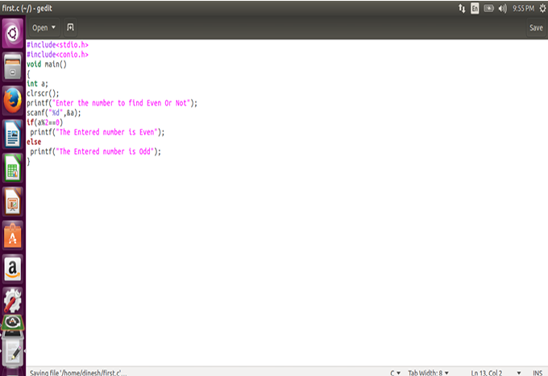
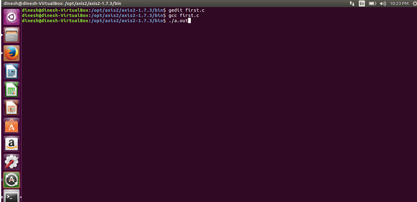
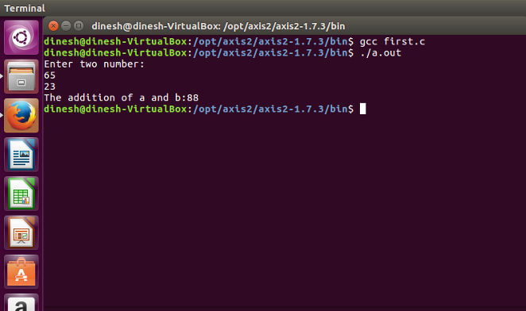

| Option | Value |
| :--- | :--- |
| **Prerequisites** | Oracle VM VirtualBox, Ubuntu Linux OVA appliance or ISO image |
| **Estimated Time**| 30 minutes |
| **Technology** | Oracle VM VirtualBox, Ubuntu Linux, GCC (GNU Compiler Collection), Gedit / Nano |

---

## 🎯 Aim
To import an Ubuntu Linux virtual machine in Oracle VM VirtualBox, configure its virtual hardware settings, install the GCC C compiler toolchain, and write, compile, and execute a simple C program.

---

## 📖 Theoretical Background

### Virtual Machines in Development Environments
Virtualization allows developers to run complete guest operating systems with specific compiler versions and library dependencies inside an isolated sandbox. This prevents dependency collisions on the host machine and allows testing under target Linux deployment environments.

### The GNU Compiler Collection (GCC) Pipeline
When compiling a C language source file in Linux, the GCC toolchain processes the source through several stages:


1. **Preprocessing (`cpp`)**: Expands header files (e.g., `<stdio.h>`), evaluates `#define` macros, and strips comments.
2. **Compilation (`gcc`)**: Translates preprocessed C code into assembly instructions.
3. **Assembly (`as`)**: Translates assembly instructions into relocatable machine-code object files (`.o`).
4. **Linking (`ld`)**: Merges object code with C runtime standard libraries to generate the final executable.

---

## 🛠️ Requirements & Setup
1. **Oracle VM VirtualBox**: Type-2 hypervisor installed on the host machine.
2. **Ubuntu Appliance / ISO**: Pre-configured Ubuntu Virtual Appliance (`.ova`) or standard Ubuntu Desktop ISO image.
3. **Compiler Package**: GNU Compiler Collection (`gcc`) and standard build utilities (`build-essential`).

---

## 🚶 Step-by-Step Procedure

### Phase A: Importing and Starting the Ubuntu Virtual Machine

1. **Open Oracle VM VirtualBox**: Launch the VirtualBox management console on your host system.
2. **Import Virtual Appliance**:
   - In VirtualBox, navigate to **File** &rarr; **Import Appliance**.
   - Click **Browse** and locate the virtual appliance file (e.g., `ubuntu_gt6.ova`).
   - Click **Next** and accept the default hardware resource allocations (RAM, CPU cores).
3. **Configure Hardware Settings**:
   - Select the newly imported virtual machine and click **Settings**.
   - Go to the **USB** section and select **USB 1.1 (OHCI) Controller** (or USB 2.0/3.0 depending on your host hardware compatibility).
   - Click **OK** to save settings.
4. **Start the Virtual Machine**:
   - Click the green **Start** button in VirtualBox.
   - The virtual machine will boot into the Ubuntu Linux graphical desktop interface.

   

---

### Phase B: Writing and Compiling the C Program

1. **Launch the Terminal**: In the Ubuntu guest desktop, open the Terminal application (or press `Ctrl + Alt + T`).
2. **Navigate to Working Directory**:
   ```bash
   cd /opt/axis2/axis2-1.7.3/bin
   # Or create your own project directory:
   # mkdir -p ~/c_programs && cd ~/c_programs
   ```
3. **Create the C Source File**:
   Open a text editor (such as `gedit` or `nano`) to create your C source file:
   ```bash
   gedit hello.c
   ```

   

4. **Write the C Program**:
   Enter the following C code in the editor:

   ```c
   #include <stdio.h>

   int main() {
       printf("WELCOME TO C PROGRAMMING IN VIRTUAL MACHINE\n");
       printf("Hello, Cloud Computing Lab!\n");
       return 0;
   }
   ```

   Save the file (`Ctrl + S`) and close the editor.

   

5. **Compile the C Program**:
   Use the GCC compiler to build the program:
   ```bash
   gcc hello.c
   ```
   *(Optionally, use `gcc hello.c -o hello` to specify a custom executable binary name).*

   

---

### Phase C: Executing the Program & Viewing Results

1. **Execute the Binary**:
   Run the compiled executable by specifying the relative path `./`:
   ```bash
   ./a.out
   ```
   *(Or `./hello` if compiled with `-o hello`).*

2. **Verify Output**:
   The output text generated by `printf` will be printed directly to the terminal console.

   

---

## 💻 Program Code & Shell Session

### Source Code (`hello.c`)
```c
#include <stdio.h>

int main() {
    printf("==========================================\n");
    printf("   CLOUD COMPUTING LAB - VIRTUAL MACHINE  \n");
    printf("==========================================\n");
    printf("Status: C Compiler successfully configured\n");
    printf("Output: Hello World from Guest Ubuntu OS!\n");
    return 0;
}
```

### Terminal Compilation Log
```bash
$ cd ~/c_programs
$ ls -l
-rw-rw-r-- 1 student student 318 Oct  7 10:15 hello.c

$ gcc hello.c -o hello
$ ls -l
-rwxrwxr-x 1 student student 16720 Oct  7 10:16 hello
-rw-rw-r-- 1 student student   318 Oct  7 10:15 hello.c

$ ./hello
==========================================
   CLOUD COMPUTING LAB - VIRTUAL MACHINE  
==========================================
Status: C Compiler successfully configured
Output: Hello World from Guest Ubuntu OS!
```

---

## 📊 Expected Results

```text
==========================================
   CLOUD COMPUTING LAB - VIRTUAL MACHINE  
==========================================
Status: C Compiler successfully configured
Output: Hello World from Guest Ubuntu OS!
```

---

## 🎯 Conclusion
The Ubuntu Linux virtual appliance was successfully imported and initialized in Oracle VM VirtualBox. The GCC development toolchain was verified by authoring, compiling, and executing a C program inside the isolated guest operating system, demonstrating the feasibility of virtualized development environments.
