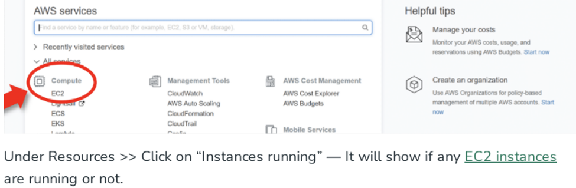
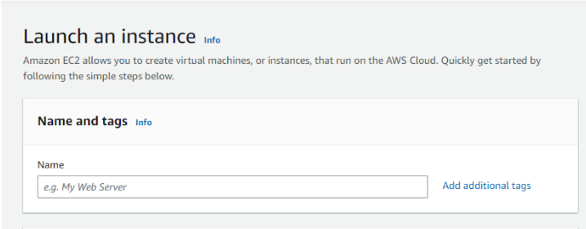
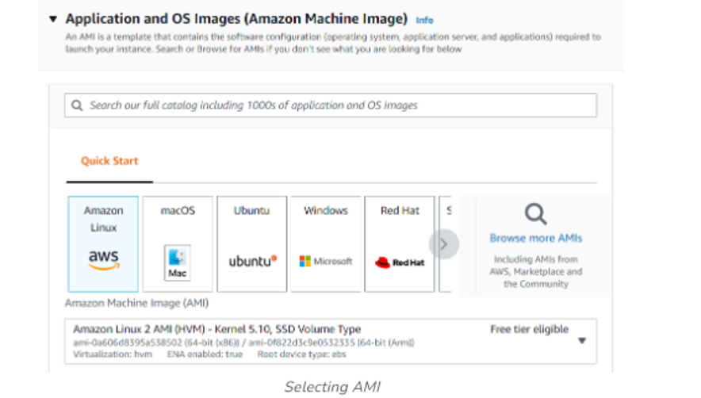
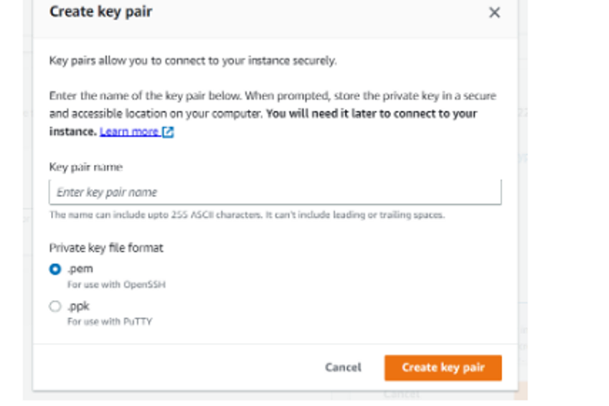
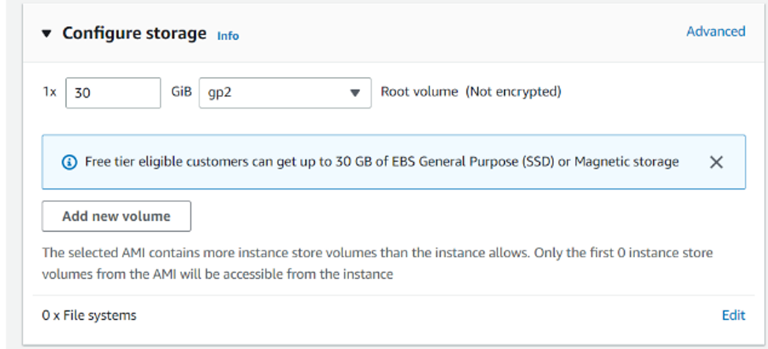
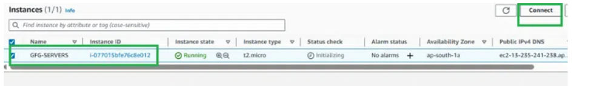
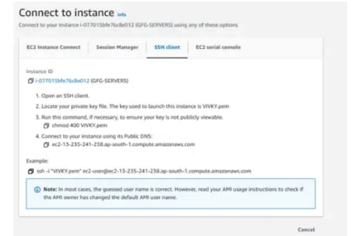
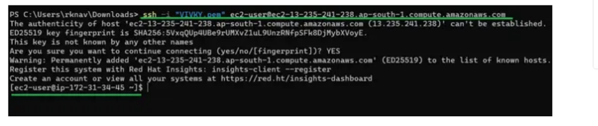

| Option | Value |
| :--- | :--- |
| **Prerequisites** | AWS Free Tier Account |
| **Estimated Time**| 30 minutes |
| **Technology** | AWS EC2 (Elastic Compute Cloud), SSH, Security Groups, Key Pairs |

---

## 🎯 Aim
To create, configure, and launch an Amazon EC2 (Elastic Compute Cloud) Linux instance in the AWS Cloud, and establish a remote terminal connection using an SSH Key Pair.

---

## 📖 Theoretical Background

### Amazon EC2 (Elastic Compute Cloud)
Amazon EC2 is a web service that provides secure, resizable compute capacity in the cloud. It is classified as an **Infrastructure as a Service (IaaS)** offering because it allows users to lease virtual servers (instances) on-demand, giving complete control over the operating system, storage, and networking.

### Key Concepts:
* **AMI (Amazon Machine Image)**: A pre-configured template containing the OS, application server, and applications needed to launch your instance.
* **Instance Type**: Defines the CPU, memory, storage, and networking capacity of the host computer. For free tier eligibility, we use the `t2.micro` or `t3.micro` instance type.
* **Security Group**: A virtual firewall that controls incoming and outgoing traffic for your instance.
* **Key Pair (SSH Key)**: A cryptographic key pair used for authentication. The public key is stored on the EC2 instance, and the private key (`.pem` file) is kept by the user to securely log in via SSH.

---

## 🛠️ Requirements & Setup
- An active AWS account. If you do not have one, refer to the [AWS Account Setup Guide](../../docs/aws-setup-guide.md).
- A terminal client:
  - **Linux/macOS**: Native Terminal.
  - **Windows**: PowerShell, Command Prompt, or Git Bash.

---

## 🚶 Step-by-Step Procedure

### Phase A: Launching the EC2 Instance
1. **Log in and navigate**: Go to the [AWS Management Console](https://aws.amazon.com/console/) and sign in. Under the **Services** menu on the top-left, select **EC2** under the Compute category.

   

2. **Start Wizard & Name the Instance**: Click on the **Launch Instance** button. In the *Name and tags* section, specify a name for your server (e.g., `Lab-Web-Server`).

   

3. **Choose Operating System (AMI)**: In the *Application and OS Images (Amazon Machine Image)* section, select **Ubuntu** (or Amazon Linux). Ensure the selected AMI has the label **"Free tier eligible"**.

   

4. **Select Instance Type**: Under *Instance type*, select `t2.micro`. Ensure it displays the **"Free tier eligible"** tag to avoid any unexpected charges.

   

5. **Configure Storage & Key Pair**:
   - Under *Key pair (login)*, click **Create new key pair** to generate a `.pem` file.
   - Keep default network settings.
   - Under storage configuration, verify that it selects free tier storage (Up to 30 GB EBS is eligible).

   

   > [!IMPORTANT]
   > Save the downloaded `.pem` key-pair file in a secure directory. You will need it to connect to the server.

6. **Launch Instance**: Review the configurations on the right pane and click **Launch instance**.

---

### Phase B: Connecting to the EC2 Instance using SSH
1. **Locate Connection Details**:
   - Select your running instance in the EC2 Console.
   - Click the **Connect** button at the top menu.

   

2. **Retrieve SSH Command**:
   - Navigate to the **SSH client** tab.
   - Copy the example connection command shown at the bottom.

   

3. **Establish SSH Connection**:
   - Open your terminal (e.g., Command Prompt, Powershell, or Git Bash).
   - Navigate to the directory where your `.pem` file is located (e.g., `cd Downloads`).
   - Run the copied SSH command to connect to your EC2 instance.

   

---

## 🧪 Expected Output & Verification
- Once successfully authenticated, the terminal prompt will change to show the virtual machine's command prompt:
  ```bash
  ubuntu@ip-172-31-xx-xx:~$
  ```
- Run the system updates command to verify internet connectivity:
  ```bash
  sudo apt-get update
  ```


