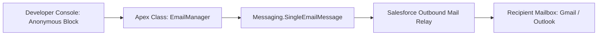
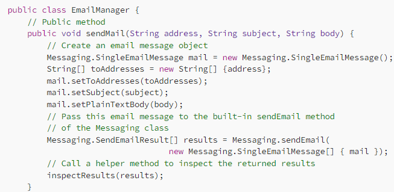
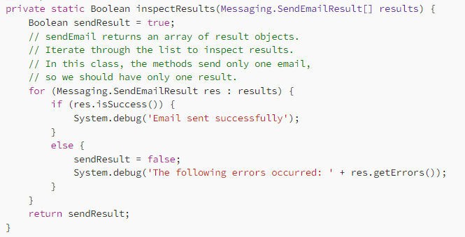
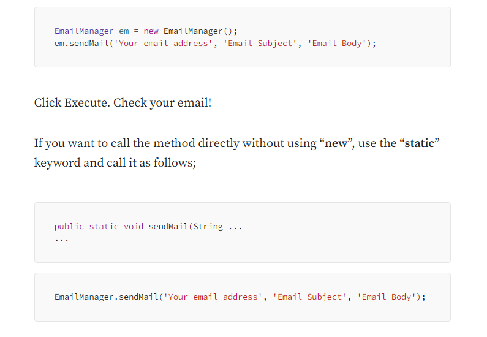

| Option | Value |
| :--- | :--- |
| **Prerequisites** | Salesforce Developer Org Account |
| **Estimated Time**| 30 minutes |
| **Technology** | Salesforce Platform (PaaS), Apex Programming Language, Developer Console |

---

## 🎯 Aim
To implement an automated outbound email messaging service using the **Apex** programming language on the Salesforce Cloud platform, and execute the service via the Developer Console to dispatch emails to an external email address.

---

## 📖 Theoretical Background

### Salesforce Cloud Outbound Email Architecture
Salesforce provides built-in email infrastructure that allows applications and business processes to dispatch transactional notifications, alerts, and customer messages directly from cloud servers without needing an external SMTP relay.



### Key Components of the Messaging API
1. **`Messaging.SingleEmailMessage`**: The class used to construct individual email messages, specifying recipient addresses, subject headers, plain text, and HTML body content.
2. **`Messaging.sendEmail()`**: The static dispatch method that transmits an array of configured email message objects to Salesforce's outbound mail servers.
3. **`Messaging.SendEmailResult`**: The return payload object containing delivery status (`isSuccess()`) and detailed diagnostic error information.

---

## 🛠️ Requirements & Setup
- An active Salesforce Developer Org account.
- Modern web browser (Chrome, Edge, Firefox).
- Valid recipient email address to receive and verify the test message.

---

## 🚶 Step-by-Step Procedure

### Phase A: Opening the Developer Console

1. **Log in to Salesforce**: Navigate to [login.salesforce.com](https://login.salesforce.com/) and enter your credentials.
2. **Launch Developer Console**:
   - In the Lightning Experience banner, click the **Gear Icon** (Setup) in the top-right corner.
   - Select **Developer Console** to open the integrated cloud development environment.

---

### Phase B: Creating the `EmailManager` Apex Class

1. **Create New Class**:
   - In the Developer Console, click **File** &rarr; **New** &rarr; **Apex Class**.
   - In the dialog prompt, enter `EmailManager` as the class name and click **OK**.

   

2. **Implement Email Logic**:
   - Replace the default template body with the following code:

   ```apex
   public class EmailManager {
       // Public method to send a single email message
       public static void sendMail(String address, String subject, String body) {
           // Create an instance of SingleEmailMessage
           Messaging.SingleEmailMessage mail = new Messaging.SingleEmailMessage();
           
           // Specify recipient addresses
           String[] toAddresses = new String[] {address};
           mail.setToAddresses(toAddresses);
           
           // Specify subject and body
           mail.setSubject(subject);
           mail.setPlainTextBody(body);
           
           // Dispatch email via Salesforce Messaging API
           Messaging.SendEmailResult[] results = Messaging.sendEmail(
               new Messaging.SingleEmailMessage[] { mail }
           );
           
           // Inspect delivery results
           inspectResults(results);
       }
       
       // Helper method to verify delivery success
       private static Boolean inspectResults(Messaging.SendEmailResult[] results) {
           Boolean sendResult = true;
           for (Messaging.SendEmailResult res : results) {
               if (res.isSuccess()) {
                   System.debug('Email dispatched successfully to recipient.');
               } else {
                   sendResult = false;
                   for (Messaging.SendEmailError err : res.getErrors()) {
                       System.debug('Email dispatch failure: ' + err.getStatusCode() + ' - ' + err.getMessage());
                   }
               }
           }
           return sendResult;
       }
   }
   ```

   

3. **Save Class**:
   - Click **File** &rarr; **Save** (or press `Ctrl + S`).
   - The Salesforce compiler will validate the syntax and save the class into Org metadata.

---

### Phase C: Executing the Anonymous Block & Verifying Delivery

1. **Open Anonymous Window**:
   - In the Developer Console menu bar, navigate to **Debug** &rarr; **Open Execute Anonymous Window** (or press `Ctrl + E`).
2. **Enter Invocation Snippet**:
   - In the popup editor, write the execution call, replacing `'your_email@example.com'` with your verified active email address:

   ```apex
   String recipient = 'your_email@example.com';
   String subject = 'Cloud Computing Lab - Apex Mailing Service Test';
   String body = 'Hello! This message confirms that the Apex automated mailing service has been executed successfully on Salesforce Cloud.';

   EmailManager.sendMail(recipient, subject, body);
   ```

3. **Execute**:
   - Ensure the **Open Log** checkbox is checked at the bottom left.
   - Click the **Execute** button.

   

4. **Verify in Execution Log**:
   - When the execution log window opens, check the **Debug Only** filter box.
   - Look for the confirmation log statement:
     ```text
     |USER_DEBUG|[24]|DEBUG|Email dispatched successfully to recipient.
     ```
5. **Check Email Inbox**:
   - Open your email client (e.g., Gmail, Outlook).
   - Check your inbox (or Spam/Junk folder) for the dispatched message with the subject line *"Cloud Computing Lab - Apex Mailing Service Test"*.

---

## 💻 Full Apex Source Code

```apex
public class EmailManager {
    /**
     * Sends a plain text email to the specified address.
     * @param address Target email recipient
     * @param subject Subject line of the email
     * @param body Plain text content
     */
    public static void sendMail(String address, String subject, String body) {
        Messaging.SingleEmailMessage mail = new Messaging.SingleEmailMessage();
        String[] toAddresses = new String[] {address};
        mail.setToAddresses(toAddresses);
        mail.setSubject(subject);
        mail.setPlainTextBody(body);
        
        // Send email message
        Messaging.SendEmailResult[] results = Messaging.sendEmail(
            new Messaging.SingleEmailMessage[] { mail }
        );
        
        // Inspect results
        for (Messaging.SendEmailResult res : results) {
            if (res.isSuccess()) {
                System.debug('Email sent successfully!');
            } else {
                for (Messaging.SendEmailError err : res.getErrors()) {
                    System.debug('Error: ' + err.getStatusCode() + ': ' + err.getMessage());
                }
            }
        }
    }
}
```

---

## 📊 Expected Results

### Developer Console Execution Log
```text
49.0 APEX_CODE,DEBUG;APEX_PROFILING,INFO;CALLOUT,INFO;DB,INFO;SYSTEM,DEBUG;VALIDATION,INFO;VISUALFORCE,INFO
Execute Anonymous: EmailManager.sendMail('student@example.com', 'Lab Test', 'Email dispatched.');
10:24:12.042 (42105400)|USER_DEBUG|[18]|DEBUG|Email sent successfully!
10:24:12.043 (43152000)|EXECUTION_FINISHED
```

### Received Email Content
```text
From: noreply@salesforce.com (via Salesforce Cloud)
To: student@example.com
Subject: Cloud Computing Lab - Apex Mailing Service Test

Hello! This message confirms that the Apex automated mailing service has been executed successfully on Salesforce Cloud.
```

---

## 🎯 Conclusion
An automated outbound email messaging service was successfully constructed in Salesforce using the Apex `Messaging.SingleEmailMessage` API. The `EmailManager` class compiled without errors and dispatched transactional emails to external recipients via the Developer Console, confirming Salesforce's capability as a Platform as a Service (PaaS) application tier.
