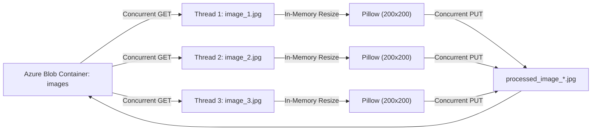

| Option | Value |
| :--- | :--- |
| **Prerequisites** | Microsoft Azure Account / Free Tier, Python 3.8+ |
| **Estimated Time**| 35 minutes |
| **Technology** | Microsoft Azure Blob Storage, Python, Pillow (PIL), `azure-storage-blob` SDK |

---

## 🎯 Aim
To implement a multithreaded image processing application in Python that connects to **Microsoft Azure Blob Storage**, concurrently downloads multiple image blobs, applies transformations (image resizing), and uploads the processed files back to the cloud container.

---

## 📖 Theoretical Background

### Object Storage in Cloud Computing
Object storage architectures manage data as discrete units called "objects" accompanied by metadata and globally unique identifiers, rather than traditional hierarchical file trees or disk blocks. **Azure Blob Storage** is optimized for massive unstructured workloads including media streaming, backups, and distributed data analysis.

### Asynchronous & Multithreaded Processing
In cloud workloads, fetching media over HTTP/REST APIs introduces network latency. Instead of processing images sequentially:



By dispatching each image to a dedicated worker thread, network I/O and CPU transformations overlap, drastically reducing total processing runtime.

---

## 🛠️ Requirements & Setup
1. **Azure Subscription**: Active account on [portal.azure.com](https://portal.azure.com).
2. **Python Environment**: Python 3.8 or higher.
3. **Python SDKs**:
   ```bash
   pip install azure-storage-blob pillow
   ```

---

## 🚶 Step-by-Step Procedure

### Phase A: Configuring Azure Storage in the Portal

1. **Sign In to Azure**: Navigate to [portal.azure.com](https://portal.azure.com) and sign in.
2. **Create Storage Account**:
   - In the Azure search bar, search for **Storage accounts** and click **Create**.
   - **Subscription**: Select your active subscription.
   - **Resource Group**: Create new (e.g., `rg-cloud-lab`).
   - **Storage Account Name**: Enter a globally unique name in lowercase (e.g., `imagestorage2026lab`).
   - **Region**: Choose the closest geographical region (e.g., *East US* or *Central India*).
   - Click **Review + Create** &rarr; **Create**.
3. **Create Blob Container**:
   - When deployment completes, click **Go to resource**.
   - In the left sidebar, navigate to **Data storage** &rarr; **Containers**.
   - Click **+ Container**.
   - **Name**: `images`
   - **Public access level**: `Private (no anonymous access)`
   - Click **Create**.
4. **Upload Sample Test Images**:
   - Click on the `images` container.
   - Click **Upload**, select 2–3 sample `.jpg` or `.png` images from your computer (e.g., `sample1.jpg`, `sample2.jpg`), and click **Upload**.
5. **Retrieve Connection String**:
   - In the Storage account left sidebar, scroll to **Security + networking** &rarr; **Access keys**.
   - Under `key1`, click **Show** next to **Connection string**.
   - Copy the connection string to your clipboard for application authentication.

---

### Phase B: Writing the Multithreaded Python Application

1. **Create Application Script**:
   Create a Python file named `app.py` and implement the thread-based processor:

   ```python
   import io
   import threading
   from azure.storage.blob import BlobServiceClient
   from PIL import Image

   # --- Azure Configuration ---
   CONNECTION_STRING = "YOUR_AZURE_CONNECTION_STRING_HERE"
   CONTAINER_NAME = "images"

   # Initialize Azure Blob Service Client
   blob_service_client = BlobServiceClient.from_connection_string(CONNECTION_STRING)


   def process_image(blob_name):
       """Downloads an image from Azure Blob, resizes it in RAM, and uploads processed version."""
       try:
           print(f"[Thread-START] Processing blob: {blob_name}")
           blob_client = blob_service_client.get_blob_client(
               container=CONTAINER_NAME, blob=blob_name
           )

           # 1. Download image payload into memory
           download_stream = blob_client.download_blob().readall()
           input_stream = io.BytesIO(download_stream)

           # 2. Open and resize with Pillow
           image = Image.open(input_stream)
           resized_image = image.resize((200, 200))

           # 3. Save modified image to in-memory byte stream
           output_stream = io.BytesIO()
           resized_image.save(output_stream, format="JPEG")
           output_stream.seek(0)

           # 4. Upload processed image to blob container
           new_blob_name = f"processed_{blob_name}"
           target_client = blob_service_client.get_blob_client(
               container=CONTAINER_NAME, blob=new_blob_name
           )
           target_client.upload_blob(output_stream, overwrite=True)

           print(
               f"[Thread-DONE] Successfully uploaded: {new_blob_name} (200x200)"
           )
       except Exception as e:
           print(f"[Thread-ERROR] Failed processing {blob_name}: {e}")


   def main():
       container_client = blob_service_client.get_container_client(
           CONTAINER_NAME
       )
       blobs = container_client.list_blobs()

       threads = []
       print("Scanning container for raw image assets...")

       for blob in blobs:
           # Avoid re-processing already modified files
           if not blob.name.startswith("processed_"):
               t = threading.Thread(target=process_image, args=(blob.name,))
               threads.append(t)
               t.start()

       # Wait for all concurrent worker threads to finish
       for t in threads:
           t.join()

       print("\nAll batch image operations completed successfully.")


   if __name__ == "__main__":
       main()
   ```

2. **Execute the Application**:
   Replace `"YOUR_AZURE_CONNECTION_STRING_HERE"` with your copied connection string and run:
   ```bash
   python app.py
   ```

---

### Phase C: Verification in Azure Portal

1. Return to the **Azure Portal** &rarr; **Storage accounts** &rarr; `images` container.
2. Click the **Refresh** button.
3. Verify that the new resized images appear alongside original files:
   - `processed_sample1.jpg`
   - `processed_sample2.jpg`
4. Click on a processed image and select **Download** to verify that dimensions have been scaled to $200 \times 200$ pixels.

---

## 💻 Full Application Code (`app.py`)

```python
import io
import threading
from azure.storage.blob import BlobServiceClient
from PIL import Image

CONNECTION_STRING = "DefaultEndpointsProtocol=https;AccountName=imagestorage2026lab;AccountKey=...;EndpointSuffix=core.windows.net"
CONTAINER_NAME = "images"

blob_service_client = BlobServiceClient.from_connection_string(
    CONNECTION_STRING
)


def process_image(blob_name):
    blob_client = blob_service_client.get_blob_client(
        container=CONTAINER_NAME, blob=blob_name
    )

    # Download raw blob into RAM
    data = blob_client.download_blob().readall()
    stream = io.BytesIO(data)

    # Process and transform image
    img = Image.open(stream)
    img = img.resize((200, 200))

    # Save to output buffer
    output = io.BytesIO()
    img.save(output, format="JPEG")
    output.seek(0)

    # Upload transformed image
    new_name = "processed_" + blob_name
    blob_service_client.get_blob_client(
        container=CONTAINER_NAME, blob=new_name
    ).upload_blob(output, overwrite=True)
    print(f"Uploaded: {new_name}")


def main():
    container_client = blob_service_client.get_container_client(CONTAINER_NAME)
    blobs = container_client.list_blobs()
    threads = []

    for blob in blobs:
        if not blob.name.startswith("processed_"):
            t = threading.Thread(target=process_image, args=(blob.name,))
            threads.append(t)
            t.start()

    for t in threads:
        t.join()

    print("Batch processing complete.")


if __name__ == "__main__":
    main()
```

---

## 📊 Expected Results

### Application Terminal Console Output
```text
Scanning container for raw image assets...
[Thread-START] Processing blob: banner.jpg
[Thread-START] Processing blob: campus_view.jpg
[Thread-DONE] Successfully uploaded: processed_banner.jpg (200x200)
[Thread-DONE] Successfully uploaded: processed_campus_view.jpg (200x200)

All batch image operations completed successfully.
```

### Azure Container Storage Verification
| Blob Name | Content Type | Blob Type | Size | Status |
| :--- | :--- | :--- | :--- | :--- |
| `banner.jpg` | image/jpeg | Block blob | 1.42 MB | Original Asset |
| `campus_view.jpg` | image/jpeg | Block blob | 2.18 MB | Original Asset |
| `processed_banner.jpg` | image/jpeg | Block blob | 38.4 KB | **Processed ($200 \times 200$)** |
| `processed_campus_view.jpg` | image/jpeg | Block blob | 42.1 KB | **Processed ($200 \times 200$)** |

---

## 🎯 Conclusion
A concurrent multithreaded image processing pipeline was successfully integrated with Microsoft Azure Blob Storage. By pairing Python's threading library with in-memory streams (`io.BytesIO`) and Azure's Python SDK, high-volume cloud media transformation tasks were executed asynchronously with minimal execution latency.
