| Option | Value |
| :--- | :--- |
| **Prerequisites** | AWS Free Tier Account |
| **Estimated Time**| 35 minutes |
| **Technology** | Amazon Web Services (AWS), EC2 (Elastic Compute Cloud), Apache HTTP Server (`httpd`), Amazon Linux |

---

## 🎯 Aim
To launch an Amazon EC2 Linux virtual server in AWS, configure its Security Group firewall to permit inbound HTTP web traffic, install and start the Apache HTTP web server (`httpd`), and deploy a responsive website template accessible globally via public IPv4.

---

## 📖 Theoretical Background

### Cloud Web Hosting on Infrastructure as a Service (IaaS)
In an IaaS model like Amazon EC2, developers have complete root control over the operating system environment. Deploying a web application involves provisioning the virtual hardware, hardening virtual firewall policies (Security Groups), installing the HTTP daemon, and copying production web assets into the web server document root.

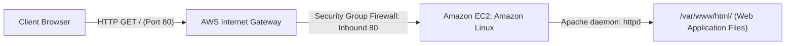

### Key Components:
1. **Amazon EC2 (`t3.micro` / `t2.micro`)**: The underlying virtual server instance providing compute, memory, and networking resources.
2. **Security Group**: Operates as a virtual firewall controlling inbound and outbound network traffic to the instance.
3. **Apache HTTPD (`httpd`)**: The web server daemon listening for incoming TCP requests on port 80 and serving static/dynamic assets.
4. **Document Root (`/var/www/html`)**: The primary filesystem directory where HTML, CSS, JavaScript, and media assets are loaded by Apache.

---

## 🛠️ Requirements & Setup
- An active AWS account.
- Web browser (Chrome, Firefox, Edge).
- Internet access for downloading website template archives via `wget`.

---

## 🚶 Step-by-Step Procedure

### Phase A: Launching the EC2 Instance

1. **Navigate to EC2 Console**:
   - Log in to the [AWS Management Console](https://aws.amazon.com/console/).
   - In the search bar, type `EC2` and click **EC2**.
   - On the EC2 dashboard, click the **Launch instance** button.

   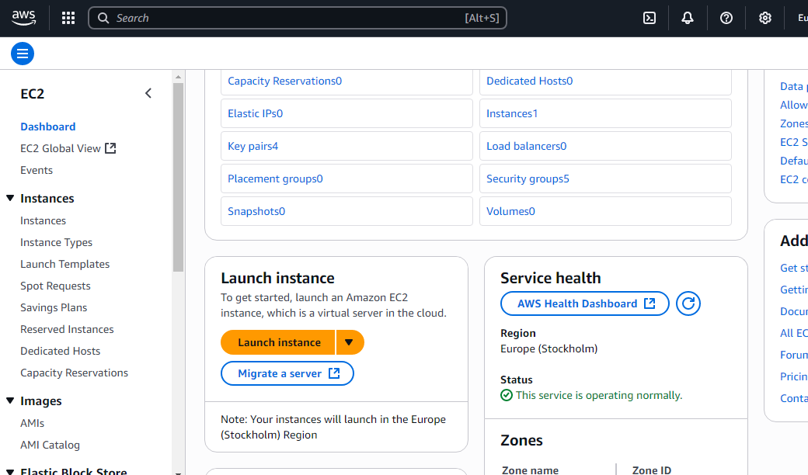

2. **Specify Name and Tags**:
   - Under **Name and tags**, assign a descriptive name (e.g., `web server` or `production-web-server`).

   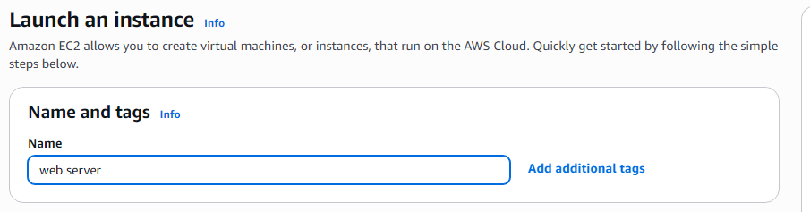

3. **Choose Operating System (AMI)**:
   - Under **Application and OS Images**, select **Amazon Linux** (Amazon Linux 2023 or Amazon Linux 2 AMI). Ensure the **"Free tier eligible"** tag is shown.

   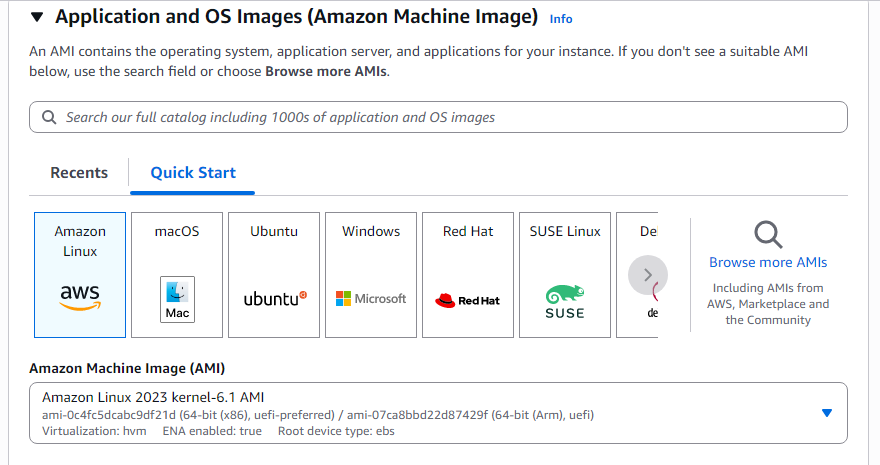

4. **Select Instance Type**:
   - Under **Instance type**, select `t3.micro` (or `t2.micro`). Verify that it has the **Free tier eligible** badge to avoid unnecessary charges.

   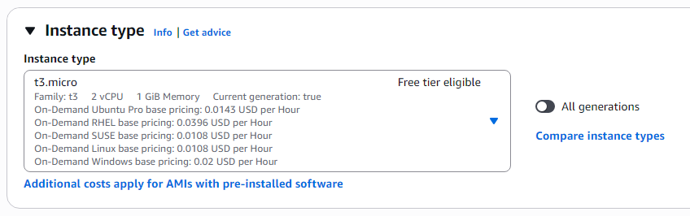

5. **Create or Select Key Pair**:
   - Under **Key pair (login)**, click **Create new key pair**.
   - Name the key pair (e.g., `kyp`).
   - Select Key pair type **RSA** and Private key file format **.pem**.
   - Click **Create key pair** and save the downloaded file to your local computer.

   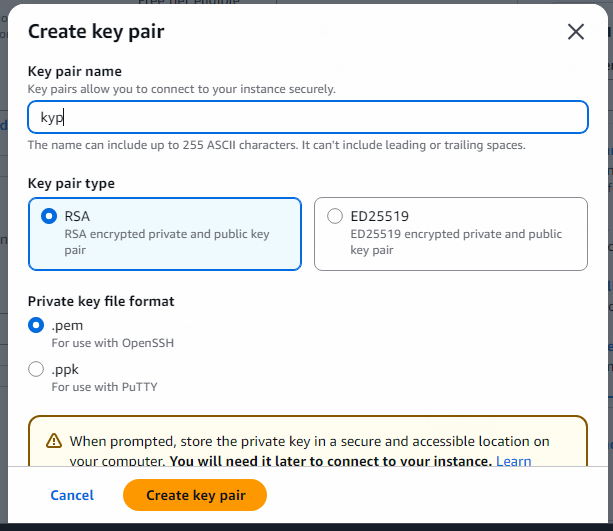

6. **Configure Network & Firewall Settings**:
   - In **Network settings**, ensure:
     - [x] **Allow SSH traffic from**: Anywhere (`0.0.0.0/0`)
     - [x] **Allow HTTPS traffic from the internet**: Enabled
     - [x] **Allow HTTP traffic from the internet**: Enabled (opens port 80)

   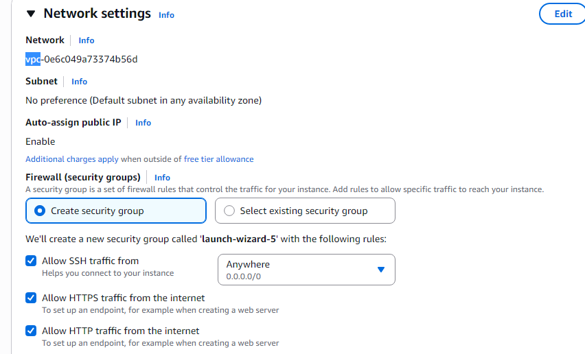

7. **Storage & Advanced Details**:
   - Leave the storage settings at default (8 GiB gp3/gp2 Free tier eligible).
   - Leave Advanced details at default settings.

   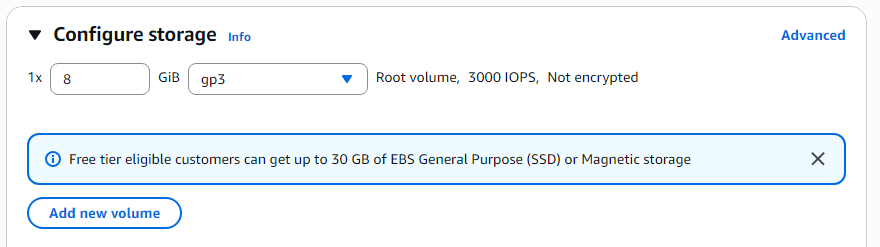

   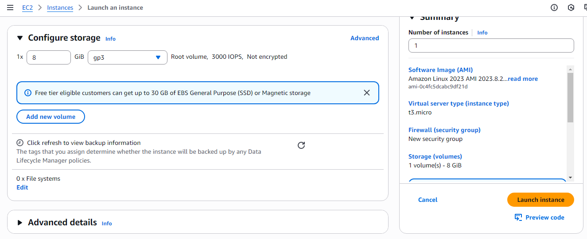

8. **Launch the Instance**:
   - In the **Summary** panel on the right, review configurations and click **Launch instance**.

   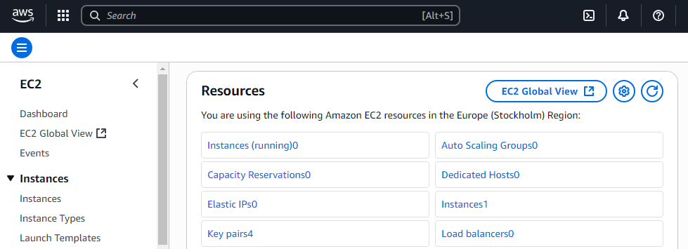

   - Wait for the confirmation screen showing the instance ID.

   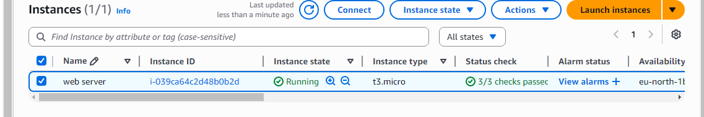

---

### Phase B: Connecting to the Server via EC2 Instance Connect

1. **Select Instance**:
   - Navigate to **Instances** in the left menu.
   - Select the checkbox next to your running `web server` instance and click **Connect** at the top.

   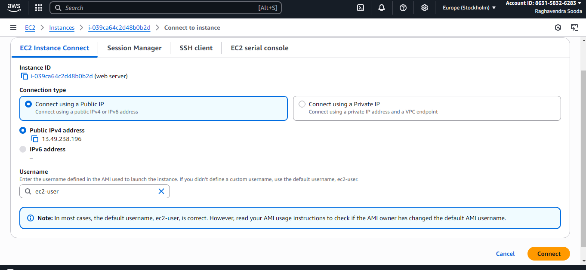

2. **Choose Connection Method**:
   - Select **EC2 Instance Connect** (browser-based terminal).
   - Ensure the username is `ec2-user`.
   - Click **Connect**. A browser terminal tab will open directly connected to the server shell.

   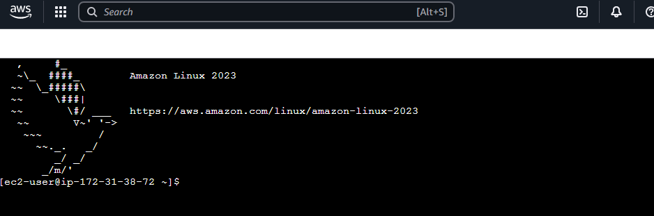

---

### Phase C: Installing Apache Web Server & Deploying Application

1. **Elevate to Root & Update Packages**:
   In the EC2 terminal shell, switch to the root user and update system packages:
   ```bash
   sudo su -
   yum update -y
   ```

2. **Install Apache HTTP Server**:
   ```bash
   yum install -y httpd
   ```

3. **Download and Extract Web Application Template**:
   ```bash
   mkdir temp && cd temp
   wget https://templatemo.com/download/templatemo_596_electric_xtra
   unzip templatemo_596_electric_xtra -d templatemo_unzipped
   cd templatemo_unzipped/*
   ```

4. **Copy Application Files to Apache Document Root**:
   ```bash
   mv * /var/www/html/
   cd /var/www/html/
   ls -la
   ```

5. **Enable and Start Apache Service**:
   ```bash
   systemctl enable httpd
   systemctl start httpd
   systemctl status httpd
   ```

   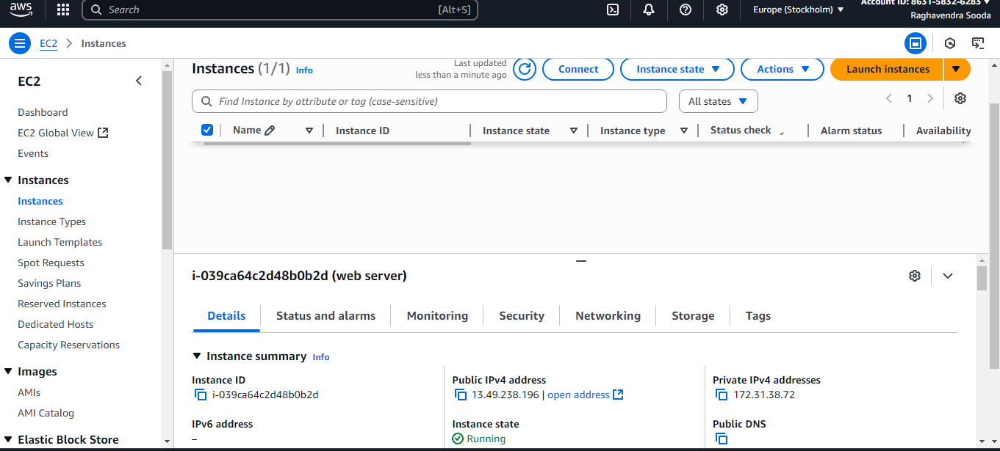

---

### Phase D: Verifying Global Web Deployment

1. Return to the **AWS EC2 Console** &rarr; **Instances**.
2. Select your instance and copy its **Public IPv4 address** (e.g., `13.49.238.196`).
3. Open a new browser tab and navigate to:
   ```text
   http://YOUR_PUBLIC_IP/
   ```
   *(Note: Ensure you type `http://` and not `https://`, as SSL certificates have not yet been installed).*
4. The deployed web application template will load successfully in your browser!

   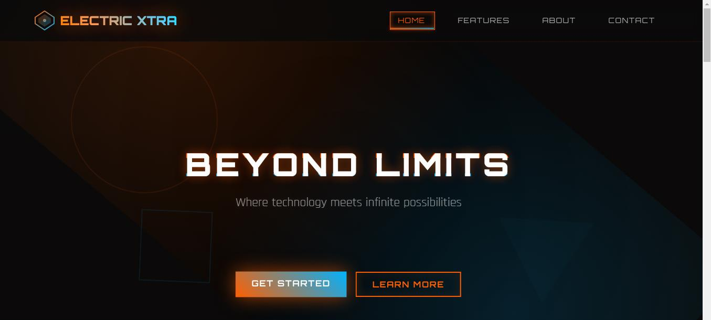

---

## 💻 Complete Deployment Script

```bash
#!/bin/bash
# Update installed packages
yum update -y

# Install Apache Web Server and Unzip utility
yum install -y httpd unzip wget

# Download responsive website template
mkdir -p /tmp/website_setup && cd /tmp/website_setup
wget https://templatemo.com/download/templatemo_596_electric_xtra -O site_template.zip
unzip site_template.zip -d extracted_site

# Deploy assets to web root
cp -r extracted_site/*/* /var/www/html/

# Adjust permissions
chown -R apache:apache /var/www/html/
chmod -R 755 /var/www/html/

# Enable and start Apache HTTP daemon
systemctl enable httpd
systemctl restart httpd

echo "Web deployment complete. Check status with: systemctl status httpd"
```

---

## 📊 Expected Results

### Apache Service Status Output
```text
● httpd.service - The Apache HTTP Server
   Loaded: loaded (/usr/lib/systemd/system/httpd.service; enabled; vendor preset: disabled)
   Active: active (running) since Wed 2026-10-07 14:45:12 UTC; 2min 35s ago
 Main PID: 2841 (httpd)
   Status: "Total requests: 12; Idle/Busy workers 100/0; Requests/sec: 0.08"
   CGroup: /system.slice/httpd.service
           ├─2841 /usr/sbin/httpd -DFOREGROUND
           ├─2842 /usr/sbin/httpd -DFOREGROUND
           └─2843 /usr/sbin/httpd -DFOREGROUND
```

---

## 🎯 Conclusion
An Amazon Linux EC2 instance was successfully launched in AWS with HTTP Port 80 ingress rules. The Apache HTTP web server (`httpd`) was installed, configured to boot automatically via systemd, and populated with a web application template, demonstrating full public web application deployment on cloud compute infrastructure.
