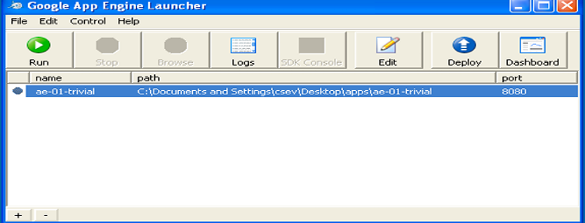
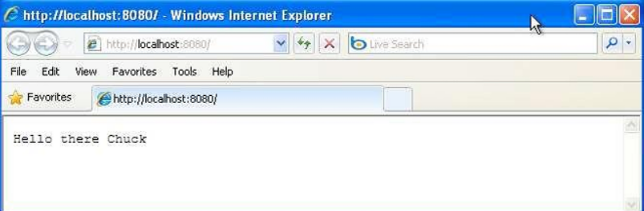
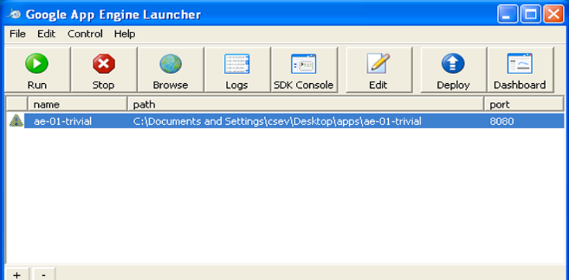
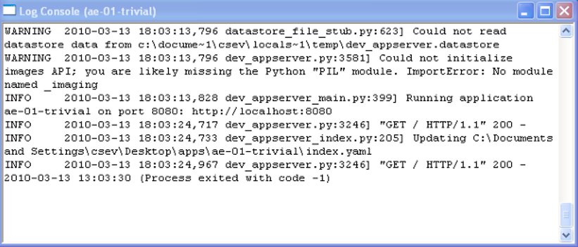

| Option | Value |
| :--- | :--- |
| **Prerequisites** | Python installed, Google App Engine SDK / Launcher, Text Editor |
| **Estimated Time**| 30 minutes |
| **Technology** | Google Cloud Platform (GCP), Google App Engine (PaaS), Python |

---

## 🎯 Aim
To develop and launch a simple Python-based web application locally using the **Google App Engine (GAE) Launcher** (and deploy it to the cloud using GAE SDK commands).

---

## 📖 Theoretical Background

### Platform as a Service (PaaS)
Google App Engine is a fully-managed **Platform as a Service (PaaS)** model. Developers only write the application code and configuration files, while Google handles provisioning of servers, load balancing, database management, and scaling.

### Key Concepts:
* **`app.yaml`**: The configuration file that defines the application parameters (application ID, runtime language, version, and mapping of URLs to server scripts).
* **Python Runtime**: GAE runs applications in secure, sandboxed environments. Legacy GAE Launcher environments ran Python 2.7, whereas modern GAE environments support standard Python 3.x runtimes.

---

## 🛠️ Requirements & Setup
- **Python**: Installed on your system (Python 2.7 for legacy launcher, Python 3 for modern SDK).
- **Google App Engine Launcher / SDK**: Installed on your host machine.

---

## 🚶 Step-by-Step Procedure (Legacy GAE Launcher)

### Step 1: Create the Project Directory
1. Create a main working directory for your projects (e.g., `C:\apps\`).
2. Within the `apps` folder, create a subdirectory named `ae-01-trivial` (e.g., `C:\apps\ae-01-trivial\`).

### Step 2: Create the Configuration File (`app.yaml`)
In the `ae-01-trivial` folder, create a new text file named `app.yaml` and enter the following contents:
```yaml
application: ae-01-trivial
version: 1
runtime: python
api_version: 1

handlers:
- url: /.*
  script: index.py
```
> [!IMPORTANT]
> Indentation in `.yaml` files must be exact. Do not use tabs; use spaces.

### Step 3: Create the Application Script (`index.py`)
In the same folder, create a file named `index.py` with the following code to print a simple text response:
```python
print 'Content-Type: text/plain'
print ''
print 'Hello there Chuck'
```

### Step 4: Add the Application to GAE Launcher
1. Open the **GoogleAppEngineLauncher** application.
2. Navigate to **File** ➔ **Add Existing Application...**
3. Browse and select your `ae-01-trivial` folder, then click **OK**.
4. Select your application from the dashboard list.

   

### Step 5: Run and Browse the Application
1. Click the **Run** button at the top menu.
2. Wait a few moments. Once started, a green status light will appear next to the application name.

3. Click the **Browse** button. This opens a web browser pointing to `http://localhost:8080/`.
4. The browser window will display:
   ```text
   Hello there Chuck
   ```

   

### Step 6: Modifying and Live Reloading
1. Open `index.py` in your text editor.
2. Change the name `'Chuck'` to your own name.
3. Save the file.
4. Refresh your browser window. The change will reflect immediately without needing to restart the App Engine Launcher.

---

### Phase B: Monitoring and Error Handling

#### 1. Watching the Logs
1. Select your application in the Launcher dashboard.
2. Click the **Logs** button to open the log console window.
3. Every time you refresh the page in the browser, you will see a corresponding `GET` request logged.

   

#### 2. Dealing with Errors
1. If you introduce a mistake in your `app.yaml` file, App Engine will fail to start.
2. The launcher dashboard will display a yellow warning icon next to your application name.

   

3. Review the logs to troubleshoot and find detailed compilation/configuration error reports.

---

## 🛠️ Modern Alternative: Using the Google Cloud CLI (gcloud SDK)
*Since the standalone GAE Launcher GUI is deprecated in modern Google Cloud SDKs, the CLI is the current standard.*

### 1. Update files for Python 3 (Modern Standard)
In the modern runtime, Google App Engine requires Python 3 and web frameworks like **Flask**.

#### Updated `app.yaml`
```yaml
runtime: python39
```

#### Updated `main.py` (replacing `index.py`)
```python
from flask import Flask
app = Flask(__name__)

@app.route('/')
def hello():
    return 'Hello there Chuck (Running on Python 3 GAE Standard)'

if __name__ == '__main__':
    app.run(host='127.0.0.1', port=8080, debug=True)
```

#### Updated `requirements.txt`
```text
Flask==2.2.3
```

### 2. Run Locally using gcloud CLI
1. Open your terminal in the directory.
2. Run the development server command:
   ```bash
   dev_appserver.py app.yaml
   ```
3. Open `http://localhost:8080/` in your browser.

---

## 🧪 Expected Output & Verification
- **Local host Access**: Visiting `http://localhost:8080/` shows the plain text response.
- **Log Verification**: Click the **Logs** button in GAE Launcher. You should see `GET / HTTP/1.1` requests returning status `200` (success).


