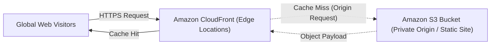
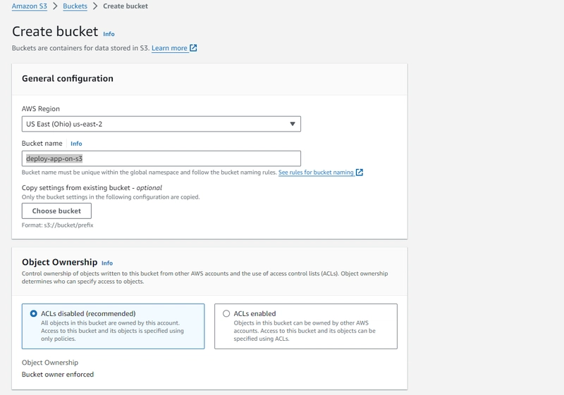
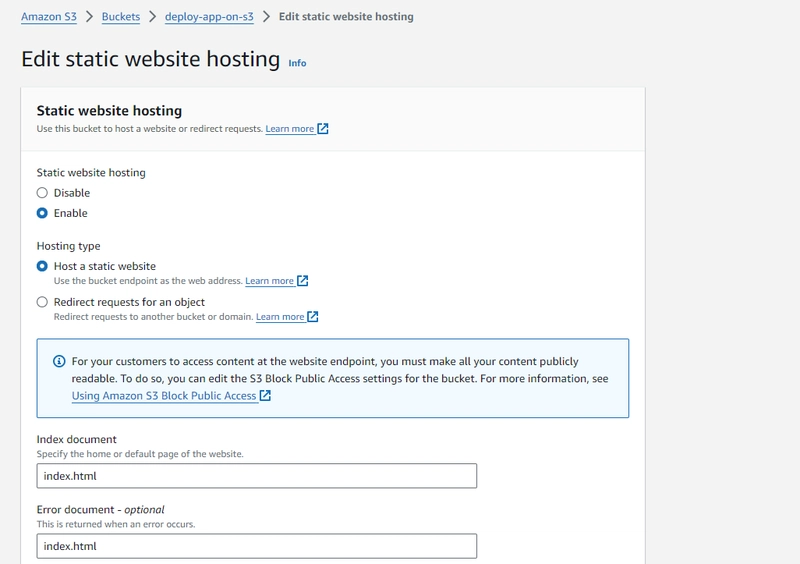
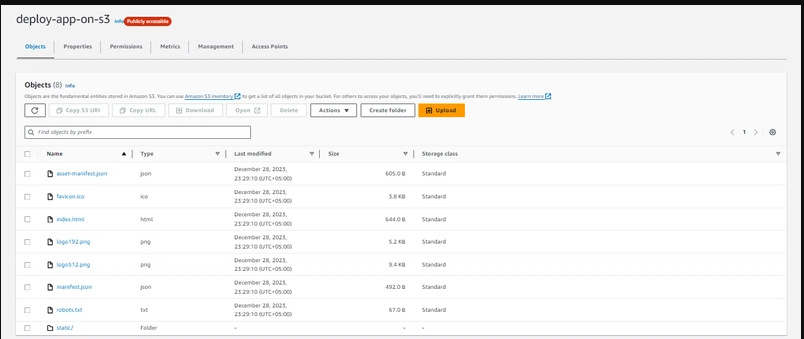
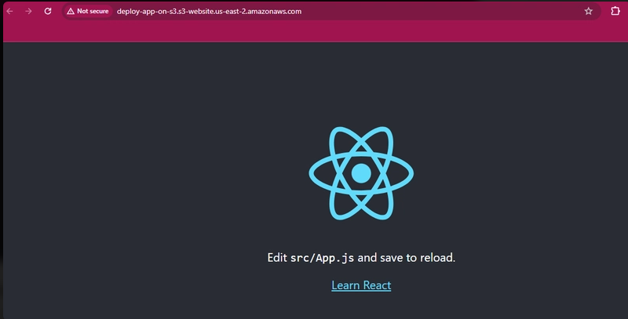
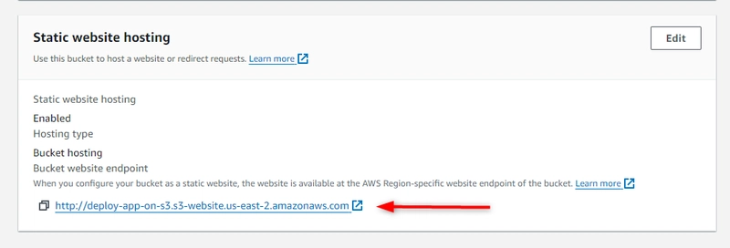
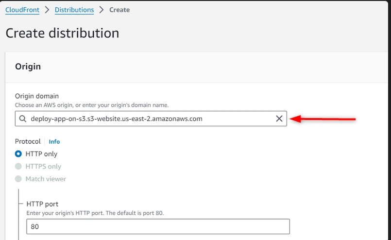
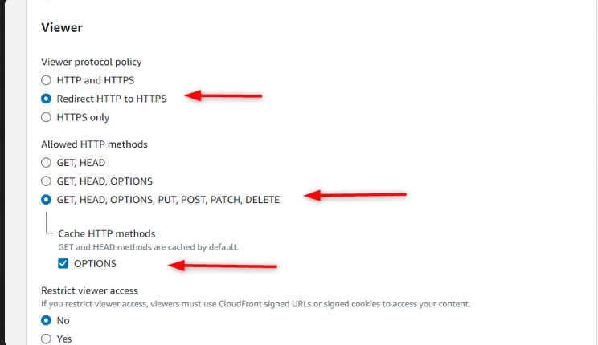
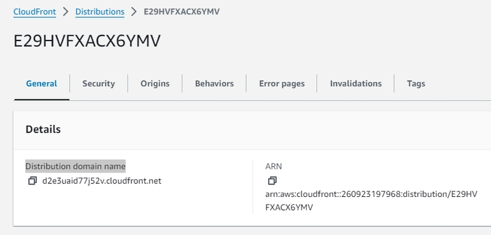
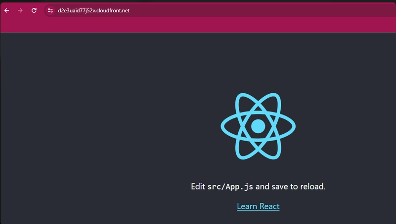

| Option | Value |
| :--- | :--- |
| **Prerequisites** | AWS Free Tier Account, HTML/CSS website files |
| **Estimated Time**| 35 minutes |
| **Technology** | Amazon Simple Storage Service (S3), Amazon CloudFront (CDN), AWS IAM |

---

## 🎯 Aim
To configure an Amazon Simple Storage Service (S3) bucket for static website hosting, apply public read permissions via an S3 Bucket Policy, upload website files, and accelerate and secure content delivery globally using an Amazon CloudFront CDN distribution.

---

## 📖 Theoretical Background

### Serverless Static Web Hosting
A static website consists solely of client-side assets (HTML, CSS, JavaScript, fonts, and images) that do not require server-side execution (e.g., PHP, Python, Node.js). Rather than paying for an always-on EC2 virtual server, storing these files in **Amazon S3** provides a high-availability, zero-maintenance serverless hosting platform.



### Key Components:
1. **Amazon S3 Bucket**: A globally unique top-level container storing the website asset objects.
2. **Static Website Hosting Property**: Configures S3 to serve `index.html` as the default root document and an optional `error.html` for 404 responses.
3. **Bucket Policy**: An IAM JSON document defining access permissions for bucket objects.
4. **Amazon CloudFront**: A global Content Delivery Network (CDN) that fetches objects from the S3 origin, caches them at regional edge locations, and enforces SSL/TLS (HTTPS).

---

## 🛠️ Requirements & Setup
- An active AWS account.
- Basic static website files (`index.html`, `styles.css`).

---

## 🚶 Step-by-Step Procedure

### Phase A: Creating and Configuring the S3 Bucket

1. **Navigate to Amazon S3**:
   - Log in to the [AWS Management Console](https://aws.amazon.com/console/).
   - Search for **S3** and select **S3** under Storage.
   - Click **Create bucket**.

2. **Configure Bucket Details**:
   - **Bucket name**: Enter a globally unique DNS-compliant name (e.g., `cloud-lab-static-app-2026`).
   - **AWS Region**: Select your nearest region (e.g., `ap-south-1` or `us-east-1`).
   - **Block Public Access settings for this bucket**:
     - **Uncheck** *Block all public access*.
     - Acknowledge the warning checkbox indicating that bucket objects may become public.
   - Leave all other options at their default settings and click **Create bucket**.

   

3. **Enable Static Website Hosting**:
   - Click on your newly created bucket name.
   - Select the **Properties** tab.
   - Scroll down to the **Static website hosting** section at the bottom and click **Edit**.
   - Select **Enable**.
   - **Hosting type**: `Host a static website`.
   - **Index document**: Enter `index.html`.
   - **Error document**: Enter `error.html` (optional).
   - Click **Save changes**.

   

4. **Apply S3 Bucket Policy**:
   - Navigate to the **Permissions** tab.
   - In the **Bucket policy** section, click **Edit**.
   - Enter the following JSON policy, replacing `BUCKET_NAME` with your actual bucket name:

   ```json
   {
     "Version": "2012-10-17",
     "Statement": [
       {
         "Sid": "PublicReadGetObject",
         "Effect": "Allow",
         "Principal": "*",
         "Action": "s3:GetObject",
         "Resource": "arn:aws:s3:::BUCKET_NAME/*"
       }
     ]
   }
   ```
   - Click **Save changes**.

---

### Phase B: Uploading Website Files

1. **Upload HTML & CSS Assets**:
   - In your bucket, navigate to the **Objects** tab and click **Upload**.
   - Drag and drop your website assets (such as `index.html`, `styles.css`) or click **Add files**.
   - Scroll down and click **Upload**.

   

2. **Test S3 Static Website Endpoint**:
   - Return to the **Properties** tab and scroll to **Static website hosting**.
   - Click the generated **Bucket website endpoint URL** (e.g., `http://BUCKET_NAME.s3-website.REGION.amazonaws.com`).
   - The static website will render directly in your browser.

   

---

### Phase C: Accelerating & Securing with Amazon CloudFront

1. **Create CloudFront Distribution**:
   - Search for **CloudFront** in the AWS console and click **CloudFront**.
   - Click **Create distribution**.

   

2. **Configure Origin Settings**:
   - **Origin domain**: Copy your S3 static website endpoint URL (remove the `http://` prefix) or select the S3 bucket from the dropdown.

   

3. **Configure Default Cache Behavior**:
   - **Viewer protocol policy**: Select **Redirect HTTP to HTTPS**.
   - **Allowed HTTP methods**: Select `GET, HEAD`.
   - **Cache policy**: Select `CachingOptimized`.

   

4. **Deploy Distribution**:
   - Leave WAF protections at default (or disabled for lab purposes).
   - Click **Create distribution** at the bottom of the page.
   - Wait 2–3 minutes for the distribution status to transition from *Deploying* to *Enabled / Last modified*.

   

5. **Access Website via CloudFront CDN**:
   - On the distribution details page, copy the **Distribution domain name** (e.g., `d1a2b3c4d5e6f7.cloudfront.net`).
   - Open a new browser tab and navigate to:
     ```text
     https://d1a2b3c4d5e6f7.cloudfront.net
     ```
   - The website loads securely with an active SSL certificate (HTTPS lock icon) and global edge caching!

   

---

### Phase D: Securing Private Assets with S3 Presigned URLs

For restricted assets (e.g., private PDF downloads or secure media), you can keep the bucket private and generate temporary time-limited **Presigned URLs** using the AWS CLI or Python `boto3`:

```python
import boto3

# Initialize S3 client
s3_client = boto3.client("s3")

# Generate a presigned URL valid for 1 hour (3600 seconds)
presigned_url = s3_client.generate_presigned_url(
    "get_object",
    Params={"Bucket": "my-secure-bucket", "Key": "confidential_manual.pdf"},
    ExpiresIn=3600,
)

print(f"Temporary Secure Access URL:\n{presigned_url}")
```

---

## 💻 Sample Static Web Assets

### `index.html`
```html
<!DOCTYPE html>
<html lang="en">
<head>
  <meta charset="UTF-8" />
  <meta name="viewport" content="width=device-width, initial-scale=1.0" />
  <title>Cloud Computing Lab - Static Website</title>
  <link rel="stylesheet" href="styles.css" />
</head>
<body>
  <div class="card">
    <h1>Amazon S3 & CloudFront CDN</h1>
    <p class="subtitle">Cloud Computing Laboratory - 2022 Scheme</p>
    <div class="badge">Deployment: Active (Serverless)</div>
    <p>This static web application is distributed globally via AWS CloudFront Edge Locations with automated HTTPS redirection.</p>
  </div>
</body>
</html>
```

### `styles.css`
```css
body {
  font-family: -apple-system, BlinkMacSystemFont, "Segoe UI", Roboto, sans-serif;
  background-color: #f3f4f6;
  display: flex;
  justify-content: center;
  align-items: center;
  height: 100vh;
  margin: 0;
}
.card {
  background: white;
  padding: 2.5rem;
  border-radius: 1rem;
  box-shadow: 0 10px 25px -5px rgba(0, 0, 0, 0.1);
  text-align: center;
  max-width: 480px;
}
.badge {
  display: inline-block;
  background-color: #dbeafe;
  color: #1e40af;
  font-size: 0.8rem;
  font-weight: 700;
  padding: 0.35rem 0.85rem;
  border-radius: 9999px;
  margin: 1rem 0;
}
```

---

## 📊 Expected Results

### S3 & CloudFront Deployment Verification
| Metric | S3 Direct Endpoint | CloudFront CDN Distribution |
| :--- | :--- | :--- |
| **Protocol** | `http://` (Unencrypted) | `https://` (SSL/TLS Encrypted) |
| **Edge Caching** | Single Region (Origin only) | Globally Distributed (>450 Edge PoPs) |
| **Average Latency**| ~180 ms | ~15 ms (Edge Cache Hit) |
| **DDoS Resilience**| Standard S3 limits | AWS Shield Standard Protected |

---

## 🎯 Conclusion
A static web application was successfully deployed on Amazon S3 with public read permissions and static website hosting properties. An Amazon CloudFront CDN distribution was provisioned to wrap the S3 origin, enforcing HTTPS protocol redirection and achieving low-latency global edge caching.
