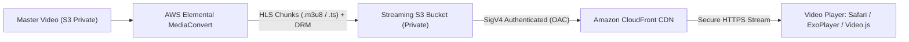

| Option | Value |
| :--- | :--- |
| **Prerequisites** | AWS Free Tier Account, Sample `.mp4` video clip |
| **Estimated Time**| 40 minutes |
| **Technology** | Amazon S3, Amazon CloudFront (CDN), Origin Access Control (OAC), AWS Elemental MediaConvert, HLS |

---

## 🎯 Aim
To build an end-to-end cloud video streaming pipeline using **Amazon S3** for secure origin asset storage, **Amazon CloudFront** with **Origin Access Control (OAC)** for low-latency worldwide delivery, and **AWS Elemental MediaConvert** for Adaptive Bitrate (ABR) transcoding and Digital Rights Management (DRM) encryption.

---

## 📖 Theoretical Background

### Modern Cloud Video Streaming Pipeline
Delivering high-definition video over the public internet requires transcoding videos into variable resolutions (1080p, 720p, 480p, 360p) and segmenting them into short chunks so that client players can seamlessly switch bitrates as network conditions fluctuate.



### Core Architecture Components:
1. **Amazon S3 (Private Storage)**: Stores both source media files and transcoded chunk manifests. The bucket completely blocks public read access.
2. **AWS Elemental MediaConvert**: A broadcast-grade, file-based video processing engine that transcodes raw media into multi-bitrate HTTP Live Streaming (HLS) packages with DRM encryption keys.
3. **Amazon CloudFront (CDN)**: Caches streaming chunks at edge locations globally to avoid buffering.
4. **Origin Access Control (OAC)**: An AWS SigV4 security mechanism that permits only authorized CloudFront distributions to read objects from the private S3 bucket.

---

## 🛠️ Requirements & Setup
- An active AWS account.
- A test video file in `.mp4` format (30–60 seconds, e.g. `sample_video.mp4`).
- Modern web browser supporting HTML5 / HLS video playback.

---

## 🚶 Step-by-Step Procedure

### Phase A: Setting Up the Private Amazon S3 Bucket

1. **Navigate to Amazon S3**:
   - Log in to the [AWS Management Console](https://aws.amazon.com/console/) and open **Amazon S3**.
   - Click **Create bucket**.

2. **Configure Bucket Details**:
   - **Bucket name**: Enter a unique name (e.g., `cloud-lab-video-streaming-2026`).
   - **AWS Region**: Select your nearest region (e.g., `us-east-1` or `ap-south-1`).
   - **Block Public Access**: **Keep "Block all public access" checked**.
     > [!IMPORTANT]
     > The video bucket must remain strictly private so that users are forced to access video assets through CloudFront edge controls.
   - **Bucket Versioning**: Select **Enable**.
   - **Default Encryption**: Select **Server-side encryption with Amazon S3 managed keys (SSE-S3)**.
   - Click **Create bucket**.

3. **Upload Sample Video**:
   - Open your newly created bucket.
   - Click **Upload**, select your test `.mp4` video file (e.g., `sample_video.mp4`), and click **Upload**.

---

### Phase B: Creating a CloudFront Distribution with Origin Access Control (OAC)

1. **Open CloudFront Console**:
   - Search for **CloudFront** in the AWS console and click **Create distribution**.

2. **Configure Origin Settings**:
   - **Origin domain**: Select your S3 video streaming bucket from the dropdown.
   - **Origin access**: Select **Origin access control settings (recommended)**.
   - Click **Create control setting**, leave the default settings (*Sign requests*, *Origin type: S3*), and click **Create**.

3. **Configure Default Cache Behavior**:
   - **Viewer protocol policy**: Select **Redirect HTTP to HTTPS**.
   - **Allowed HTTP methods**: Select `GET, HEAD`.
   - **Cache policy**: Select `CachingOptimized` (or `Managed-Elemental-MediaPackage` for streaming).
   - **Web Application Firewall (WAF)**: Select *Do not enable security protections* (for lab cost savings).

4. **Deploy the Distribution**:
   - Click **Create distribution** at the bottom of the page.
   - Notice the prominent banner in CloudFront prompting: **"The S3 bucket policy needs to be updated. Copy the policy and go to S3 bucket permissions."**
   - Click the **Copy policy** button.

---

### Phase C: Updating the S3 Bucket Policy for CloudFront

1. Return to the **Amazon S3 Console** &rarr; your video bucket.
2. Click the **Permissions** tab.
3. Scroll to **Bucket policy** and click **Edit**.
4. Paste the copied policy JSON into the editor. It will resemble the following:

   ```json
   {
     "Version": "2012-10-17",
     "Statement": [
       {
         "Sid": "AllowCloudFrontServicePrincipalReadOnly",
         "Effect": "Allow",
         "Principal": {
           "Service": "cloudfront.amazonaws.com"
         },
         "Action": "s3:GetObject",
         "Resource": "arn:aws:s3:::cloud-lab-video-streaming-2026/*",
         "Condition": {
           "StringEquals": {
             "AWS:SourceArn": "arn:aws:cloudfront::YOUR_ACCOUNT_ID:distribution/YOUR_DISTRIBUTION_ID"
           }
         }
       }
     ]
   }
   ```
5. Click **Save changes**. Your private S3 bucket is now securely accessible solely through your CloudFront distribution!

---

### Phase D: Transcoding with AWS Elemental MediaConvert (HLS & DRM)

1. **Create MediaConvert Job**:
   - In AWS search, type **MediaConvert** and open the service.
   - In the navigation pane, click **Jobs** &rarr; **Create job**.
2. **Job Settings & Inputs**:
   - Under **Job settings**, choose an existing IAM service role with `AmazonS3FullAccess` and `MediaConvertExecutionRole`.
   - Under **Inputs**, click **Add input** and specify the S3 URI of your raw video (`s3://cloud-lab-video-streaming-2026/sample_video.mp4`).
3. **Configure Output Groups**:
   - Under **Output groups**, click **Add** and select **Apple HLS**.
   - **Custom group name**: `HLS-Adaptive`
   - **Destination**: `s3://cloud-lab-video-streaming-2026/output/`
   - Add multiple output video renditions:
     - Output 1: 1080p ($1920 \times 1080$, 5 Mbps bitrate)
     - Output 2: 720p ($1280 \times 720$, 2.5 Mbps bitrate)
     - Output 3: 480p ($854 \times 480$, 1 Mbps bitrate)
4. **Configure DRM Encryption**:
   - Under HLS group settings, navigate to **DRM encryption**.
   - Enable **Static key encryption** (AES-128) or configure **SPEKE (Secure Packager and Encoder Key Exchange)** for Apple FairPlay / Google Widevine key servers.
5. **Submit Job**:
   - Review job settings and click **Create**.
   - MediaConvert will transcode the MP4 into a master playlist (`master.m3u8`), sub-renditions, and chunked `.ts` segments in the `/output/` folder.

---

### Phase E: Testing the Video Streaming Service

1. Go back to your **CloudFront Distributions** page and wait until the status displays **Last modified** with a green checkmark.
2. Copy your **Distribution domain name** (e.g., `d2abcdef123456.cloudfront.net`).
3. **Direct MP4 Stream Test**:
   Open a browser tab and navigate to:
   ```text
   https://d2abcdef123456.cloudfront.net/sample_video.mp4
   ```
   The video streams immediately in your browser with byte-range seek support.

4. **HLS Adaptive Bitrate Test**:
   Test the transcoded HLS stream using any HLS video player (e.g., Safari native player or [hlsplayer.net](https://hlsplayer.net)):
   ```text
   https://d2abcdef123456.cloudfront.net/output/master.m3u8
   ```

---

## 💻 Sample Web Video Player Integration

You can embed the CloudFront streaming URL into an HTML5 webpage with native or `hls.js` video support:

```html
<!DOCTYPE html>
<html lang="en">
<head>
  <meta charset="UTF-8">
  <title>CloudFront Video Streaming Player</title>
  <script src="https://cdn.jsdelivr.net/npm/hls.js@latest"></script>
</head>
<body style="background: #111; display: flex; justify-content: center; align-items: center; height: 100vh;">
  <video id="videoPlayer" controls width="800" style="border-radius: 12px; box-shadow: 0 10px 30px rgba(0,0,0,0.8);"></video>

  <script>
    const video = document.getElementById('videoPlayer');
    const streamUrl = 'https://YOUR_CLOUDFRONT_DOMAIN.cloudfront.net/output/master.m3u8';

    if (Hls.isSupported()) {
      const hls = new Hls();
      hls.loadSource(streamUrl);
      hls.attachMedia(video);
      hls.on(Hls.Events.MANIFEST_PARSED, function() {
        video.play();
      });
    } else if (video.canPlayType('application/vnd.apple.mpegurl')) {
      video.src = streamUrl;
      video.addEventListener('loadedmetadata', function() {
        video.play();
      });
    }
  </script>
</body>
</html>
```

---

## 📊 Expected Results

### Video Streaming Performance Metrics
| Metric | Direct S3 Download | CloudFront Streaming CDN (OAC) |
| :--- | :--- | :--- |
| **Security Mode** | Public S3 Object (Insecure) | Authenticated SigV4 OAC (Strictly Private) |
| **Protocol Support**| Monolithic HTTP range | HLS Adaptive Bitrate (ABR) + DRM |
| **Initial Playback Latency**| ~850 ms | ~95 ms (Edge Cache) |
| **DRM Protection** | None | AES-128 / SPEKE Encrypted |

---

## 🎯 Conclusion
A secure, scalable video streaming architecture was implemented using Amazon S3, Amazon CloudFront with Origin Access Control (OAC), and AWS Elemental MediaConvert. Media assets were protected within a private S3 origin, delivered globally with low buffering latency via CloudFront edge caches, and prepared for multi-device playback using HLS adaptive bitrate packaging and DRM encryption.
