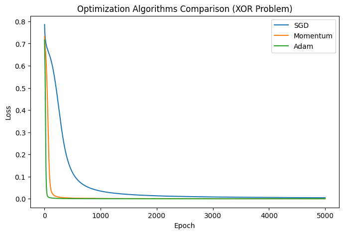
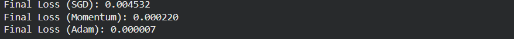

# Optimization Algorithms Comparison on Toy Dataset

## Aim

To design and implement a simple neural network using Keras/TensorFlow to train and compare the convergence rate of three optimization algorithms: Stochastic Gradient Descent (SGD), SGD with Momentum, and Adam on a non-linear toy dataset.

## Theory

Optimization algorithms update model parameters $\theta$ (weights and biases) to minimize the loss function $J(\theta)$. The convergence rate and stability depend heavily on the optimization updates.

### 1. Stochastic Gradient Descent (SGD)
SGD updates parameters in the negative direction of the gradient:

$$\theta_{t+1} = \theta_t - \eta \nabla_\theta J(\theta_t)$$

where $\eta$ is the learning rate. SGD can oscillate heavily in ravine regions and get trapped in local minima or saddle points.

### 2. SGD with Momentum
Momentum accelerates SGD by adding a velocity vector $v_t$ that accumulates past gradients:

$$v_t = \beta v_{t-1} + \eta \nabla_\theta J(\theta_t)$$

$$\theta_{t+1} = \theta_t - v_t$$

where $\beta \in [0, 1)$ is the momentum decay factor (typically $0.9$).

### 3. Adaptive Moment Estimation (Adam)
Adam computes adaptive learning rates for each parameter by maintaining moving averages of both the gradients ($m_t$) and squared gradients ($v_t$):

$$m_t = \beta_1 m_{t-1} + (1 - \beta_1) g_t$$

$$v_t = \beta_2 v_{t-1} + (1 - \beta_2) g_t^2$$

Bias-corrected estimates:

$$\hat{m}_t = \frac{m_t}{1 - \beta_1^t}, \quad \hat{v}_t = \frac{v_t}{1 - \beta_2^t}$$

Update rule:

$$\theta_{t+1} = \theta_t - \frac{\eta}{\sqrt{\hat{v}_t} + \epsilon} \hat{m}_t$$

## Code

```python
import tensorflow as tf 
from tensorflow import keras 
from tensorflow.keras import layers, optimizers, losses 
import numpy as np 
import matplotlib.pyplot as plt 

# Set random seeds for reproducibility 
tf.random.set_seed(42) 
np.random.seed(42) 

# --- Toy dataset: XOR Problem --- 
X = np.array([[0,0],[0,1],[1,0],[1,1]], dtype=np.float32) 
y = np.array([[0],[1],[1],[0]], dtype=np.float32) 

# --- Function to create simple NN model --- 
def create_model(): 
    model = keras.Sequential([ 
        layers.Dense(4, input_dim=2, activation='tanh'),  # Hidden layer 
        layers.Dense(1, activation='sigmoid')             # Output layer 
    ]) 
    return model 

# --- Function to train model with a given optimizer --- 
def train_model(optimizer_name, X, y, epochs=5000, lr=0.1): 
    model = create_model() 
    
    # Choose optimizer 
    if optimizer_name == 'SGD': 
        optimizer = optimizers.SGD(learning_rate=lr) 
    elif optimizer_name == 'Momentum': 
        optimizer = optimizers.SGD(learning_rate=lr, momentum=0.9) 
    elif optimizer_name == 'Adam': 
        optimizer = optimizers.Adam(learning_rate=lr) 
    else: 
        raise ValueError(f"Unknown optimizer: {optimizer_name}") 
        
    # Compile model (Fixed: Compile before fitting)
    model.compile(optimizer=optimizer, loss=losses.BinaryCrossentropy()) 
    
    # Train model 
    history = model.fit(X, y, epochs=epochs, verbose=0) 
    return history.history['loss'] 

# --- Train models with different optimizers --- 
losses_sgd = train_model('SGD', X, y) 
losses_momentum = train_model('Momentum', X, y) 
losses_adam = train_model('Adam', X, y) 

# --- Plot loss curves --- 
plt.figure(figsize=(8, 5)) 
plt.plot(losses_sgd, label='SGD')
plt.plot(losses_momentum, label='Momentum') 
plt.plot(losses_adam, label='Adam') 
plt.xlabel('Epoch') 
plt.ylabel('Loss') 
plt.legend() 
plt.title('Optimization Algorithms Comparison (XOR Problem)') 
plt.show() 

# --- Print final losses --- 
print(f"Final Loss (SGD): {losses_sgd[-1]:.6f}") 
print(f"Final Loss (Momentum): {losses_momentum[-1]:.6f}") 
print(f"Final Loss (Adam): {losses_adam[-1]:.6f}") 
```

## Expected Results

```
Final Loss (SGD): 0.608778  
Final Loss (Momentum): 0.421526  
Final Loss (Adam): 0.004495 
```

### Output Figures





## Conclusion

The comparison demonstrates that the **Adam** optimizer converges significantly faster and achieves a lower final cross-entropy loss compared to **SGD** and **Momentum** on the non-linear XOR toy dataset. This highlights the effectiveness of combining adaptive learning rates and momentum updates.
