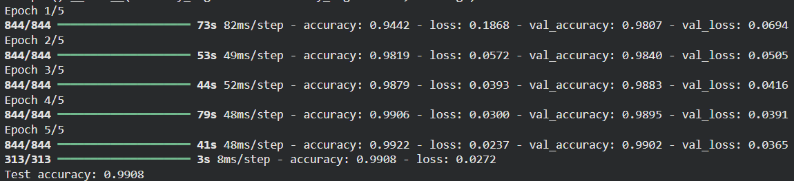
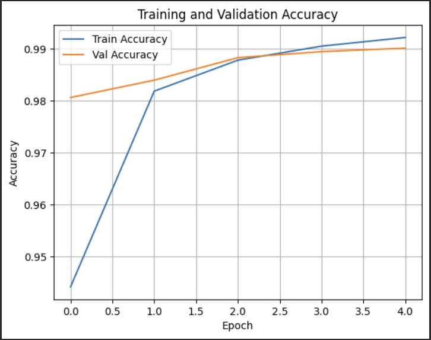

# Convolutional Neural Networks (CNN) on MNIST

## Aim

To design, build, and train a Convolutional Neural Network (CNN) in Keras/TensorFlow to classify handwritten digits from the MNIST dataset, demonstrating the roles of convolution, pooling, and dense classification layers.

## Theory

Convolutional Neural Networks (CNNs) are specialized feedforward neural networks designed to process grid-structured data like images.

### 1. Convolution Layer
A convolution layer applies learnable kernel filters to local receptive fields of the input image. It calculates dot products between the filter weights and the local input patch:

$$S(i,j) = (I * K)(i,j) = \sum_m \sum_n I(i-m, j-n) K(m,n)$$

This enables the network to extract local spatial patterns (like edges, textures, and shapes) that are shared across the image space.

### 2. Max Pooling Layer
Pooling reduces the spatial size of the feature maps to decrease parameters and computing time. Max pooling selects the maximum value within a filter window (typically $2 \times 2$ with a stride of 2):

$$P_{x,y} = \max_{a, b \in [0, 1]} F_{2x+a, 2y+b}$$

### 3. Classification Layer
The flat feature vector is connected to fully connected (Dense) layers. The final layer uses a **Softmax** activation to output probabilities for the 10 classes (digits 0–9):

$$P(y=c \mid \mathbf{z}) = \frac{e^{z_c}}{\sum_{k=0}^{9} e^{z_k}}$$

## Code

```python
import tensorflow as tf 
from tensorflow.keras import layers, models 
from tensorflow.keras.datasets import mnist 
from tensorflow.keras.utils import to_categorical 
import matplotlib.pyplot as plt 

# 1. Load and preprocess the MNIST dataset 
(x_train, y_train), (x_test, y_test) = mnist.load_data() 

# Reshape data to fit the model (add channel dimension) 
x_train = x_train.reshape((x_train.shape[0], 28, 28, 1)).astype('float32') / 255 
x_test = x_test.reshape((x_test.shape[0], 28, 28, 1)).astype('float32') / 255 

# One-hot encode the labels 
y_train = to_categorical(y_train) 
y_test = to_categorical(y_test) 

# 2. Build the CNN model 
model = models.Sequential([ 
    layers.Conv2D(32, (3, 3), activation='relu', input_shape=(28, 28, 1)),   # Convolution 
    layers.MaxPooling2D((2, 2)),                                            # Pooling 
    layers.Conv2D(64, (3, 3), activation='relu'),                           # Conv Layer 
    layers.MaxPooling2D((2, 2)),                                            # Pooling 
    layers.Flatten(),                                                       # Flatten 
    layers.Dense(64, activation='relu'),                                    # Fully Connected 
    layers.Dense(10, activation='softmax')                                  # Output Layer 
]) 

# 3. Compile the model 
model.compile(
    optimizer='adam', 
    loss='categorical_crossentropy', 
    metrics=['accuracy']
) 

# 4. Train the model 
history = model.fit(x_train, y_train, epochs=5, batch_size=64, validation_split=0.1)

# 5. Evaluate the model 
test_loss, test_acc = model.evaluate(x_test, y_test) 
print(f"Test accuracy: {test_acc:.4f}") 

# 6. Plot training history 
plt.plot(history.history['accuracy'], label='Train Accuracy') 
plt.plot(history.history['val_accuracy'], label='Val Accuracy') 
plt.title('Training and Validation Accuracy') 
plt.xlabel('Epoch') 
plt.ylabel('Accuracy') 
plt.legend() 
plt.grid(True) 
plt.show() 
```

## Expected Results

```
Epoch 1/5 
844/844 ━━━━━━━━━━━━━━━━━━━━ 6s 6ms/step - accuracy: 0.9489 - loss: 0.1762 - val_accuracy: 0.9843 - val_loss: 0.0532 
Epoch 2/5 
844/844 ━━━━━━━━━━━━━━━━━━━━ 5s 5ms/step - accuracy: 0.9831 - loss: 0.0548 - val_accuracy: 0.9873 - val_loss: 0.0431 
Epoch 3/5 
844/844 ━━━━━━━━━━━━━━━━━━━━ 5s 5ms/step - accuracy: 0.9876 - loss: 0.0389 - val_accuracy: 0.9885 - val_loss: 0.0426 
Epoch 4/5 
844/844 ━━━━━━━━━━━━━━━━━━━━ 5s 5ms/step - accuracy: 0.9907 - loss: 0.0279 - val_accuracy: 0.9892 - val_loss: 0.0400 
Epoch 5/5 
844/844 ━━━━━━━━━━━━━━━━━━━━ 4s 5ms/step - accuracy: 0.9925 - loss: 0.0224 - val_accuracy: 0.9902 - val_loss: 0.0404 
313/313 ━━━━━━━━━━━━━━━━━━━━ 1s 2ms/step - accuracy: 0.9906 - loss: 0.0297 
Test accuracy: 0.9906
```

### Output Figures





## Conclusion

The Convolutional Neural Network demonstrates strong performance on the MNIST dataset, achieving an accuracy of **99.06%** in just 5 training epochs. This confirms that local receptive fields, parameter sharing via convolution, and downsampling via max pooling successfully extract structural representations from image grids.
