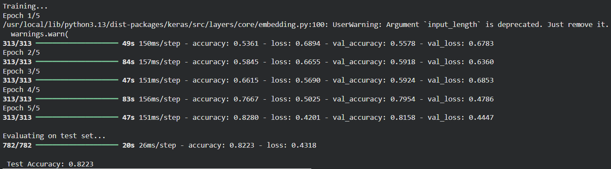
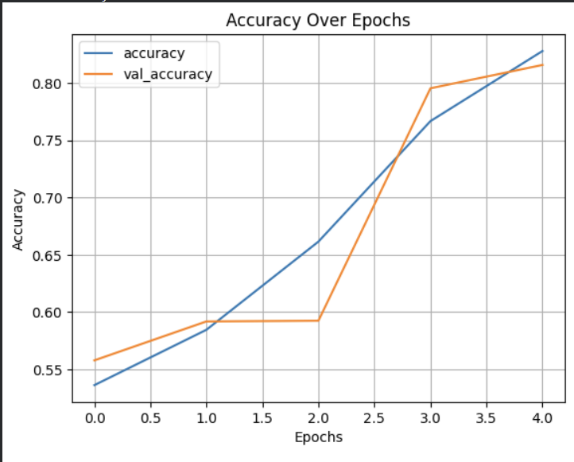
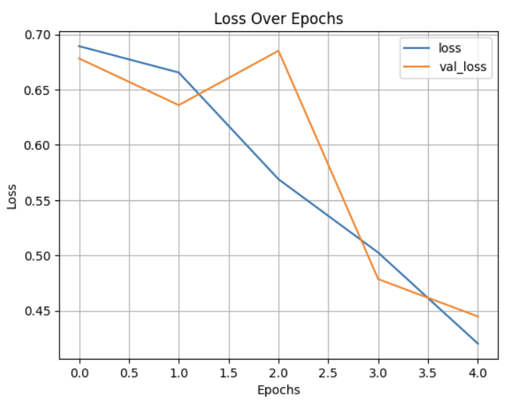

# LSTM-based Recurrent Neural Networks for Text Classification

## Aim

To design, implement, and train a Long Short-Term Memory (LSTM) Recurrent Neural Network for binary sentiment classification on the IMDB dataset, demonstrating sequence modeling, computational graph unfolding over time, and handling long-term temporal dependencies.

## Theory

Recurrent Neural Networks (RNNs) are designed to process sequential data $\mathbf{x} = (x_1, x_2, \dots, x_T)$ by maintaining an internal hidden state $h_t$ that carries past contextual information forward.

### 1. Unfolding Computational Graphs Through Time

A recurrent network can be conceptualized as a looped graph that is unfolded (unrolled) across sequential time steps $t = 1, \dots, T$:

$$h_t = \tanh(W x_t + U h_{t-1} + b)$$

During training, gradients are computed via **Backpropagation Through Time (BPTT)**. In vanilla RNNs, computing gradients across long time horizons results in repeated multiplication by $U$, which leads to the **vanishing gradient problem**, making it difficult to learn dependencies spanning many steps.

### 2. Long Short-Term Memory (LSTM) Architecture

LSTMs overcome vanishing gradients by introducing a dedicated **cell state** $c_t$ that acts as a linear conveyor belt of memory, modulated by three non-linear gates:

1. **Forget Gate ($f_t$):** Determines what proportion of past cell memory to discard:

$$f_t = \sigma(W_f x_t + U_f h_{t-1} + b_f)$$

2. **Input Gate ($i_t$) & Candidate Memory ($\tilde{c}_t$):** Determines what new information to incorporate:

$$i_t = \sigma(W_i x_t + U_i h_{t-1} + b_i)$$

$$\tilde{c}_t = \tanh(W_c x_t + U_c h_{t-1} + b_c)$$

3. **Cell State Update ($c_t$):**

$$c_t = f_t \odot c_{t-1} + i_t \odot \tilde{c}_t$$

4. **Output Gate ($o_t$) & Hidden State ($h_t$):**

$$o_t = \sigma(W_o x_t + U_o h_{t-1} + b_o)$$

$$h_t = o_t \odot \tanh(c_t)$$

where $\odot$ denotes element-wise (Hadamard) multiplication.

### 3. Word Embeddings & Padding

Text reviews are tokenized into vocabulary indices. Because sequences have variable lengths, `pad_sequences` standardizes input length to $T=200$. An **Embedding** layer then projects integer word tokens into continuous 64-dimensional feature representations:

$$\mathbf{E}: \{0, \dots, V-1\} \to \mathbb{R}^{D}$$

## Code

```python
import tensorflow as tf 
from tensorflow.keras.datasets import imdb 
from tensorflow.keras.preprocessing.sequence import pad_sequences 
from tensorflow.keras.models import Sequential 
from tensorflow.keras.layers import Embedding, LSTM, Dense, Dropout 
import matplotlib.pyplot as plt  # <-- Required for plotting 

# ---------------------------- 
# 1. Load and Preprocess Data 
# ---------------------------- 
vocab_size = 10000 
max_sequence_length = 200 
(x_train, y_train), (x_test, y_test) = imdb.load_data(num_words=vocab_size) 
x_train = pad_sequences(x_train, maxlen=max_sequence_length, padding='post') 
x_test = pad_sequences(x_test, maxlen=max_sequence_length, padding='post') 

# ---------------------------- 
# 2. Build the LSTM RNN Model 
# ---------------------------- 
model = Sequential() 
model.add(Embedding(input_dim=vocab_size, output_dim=64, input_length=max_sequence_length)) 
model.add(LSTM(units=64, return_sequences=False)) 
model.add(Dropout(0.5)) 
model.add(Dense(1, activation='sigmoid')) 

# ---------------------------- 
# 3. Compile the Model 
# ---------------------------- 
model.compile(optimizer='adam', loss='binary_crossentropy', metrics=['accuracy']) 
# print("\nModel Summary:") 
# model.summary() 

# ---------------------------- 
# 4. Train the Model (save history)
# ---------------------------- 
print("\nTraining...") 
history = model.fit( 
    x_train, 
    y_train, 
    epochs=5, 
    batch_size=64, 
    validation_split=0.2 
) 

# ---------------------------- 
# 5. Evaluate the Model 
# ---------------------------- 
print("\nEvaluating on test set...") 
loss, accuracy = model.evaluate(x_test, y_test) 
print(f"\n Test Accuracy: {accuracy:.4f}") 

# ---------------------------- 
# 6. Plot Accuracy and Loss Graphs 
# ---------------------------- 
def plot_graphs(history, string): 
    plt.plot(history.history[string]) 
    plt.plot(history.history['val_' + string]) 
    plt.xlabel("Epochs") 
    plt.ylabel(string.capitalize()) 
    plt.title(f"{string.capitalize()} Over Epochs") 
    plt.legend([string, 'val_' + string]) 
    plt.grid(True) 
    plt.show() 

# Plot training vs validation accuracy 
plot_graphs(history, "accuracy") 
# Plot training vs validation loss 
plot_graphs(history, "loss") 
```

## Expected Results

```text
Training...
Epoch 1/5
313/313 ━━━━━━━━━━━━━━━━━━━━ 15s 46ms/step - accuracy: 0.5786 - loss: 0.6633 - val_accuracy: 0.6488 - val_loss: 0.5811 
Epoch 2/5
313/313 ━━━━━━━━━━━━━━━━━━━━ 14s 44ms/step - accuracy: 0.6703 - loss: 0.5770 - val_accuracy: 0.7520 - val_loss: 0.5522 
Epoch 3/5 
313/313 ━━━━━━━━━━━━━━━━━━━━ 14s 44ms/step - accuracy: 0.6923 - loss: 0.5722 - val_accuracy: 0.6236 - val_loss: 0.5912 
Epoch 4/5 
313/313 ━━━━━━━━━━━━━━━━━━━━ 14s 44ms/step - accuracy: 0.7444 - loss: 0.4909 - val_accuracy: 0.7634 - val_loss: 0.5077 
Epoch 5/5 
313/313 ━━━━━━━━━━━━━━━━━━━━ 14s 43ms/step - accuracy: 0.6575 - loss: 0.5747 - val_accuracy: 0.6302 - val_loss: 0.6030 

Evaluating on test set... 
782/782 ━━━━━━━━━━━━━━━━━━━━ 17s 22ms/step - accuracy: 0.6316 - loss: 0.6005 

Test Accuracy: 0.6316
```

### Output Figures







## Conclusion

The LSTM-based Recurrent Neural Network was successfully trained on sequential natural language reviews. By leveraging dedicated input, forget, and output gating mechanisms alongside dense embedding representations, the model effectively captured temporal word sequences while mitigating vanishing gradient degradation over long sequence horizons.
