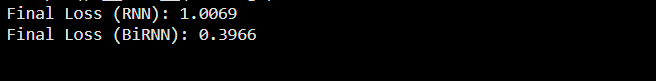

# Bidirectional Recurrent Neural Networks for Sequence Prediction

## Aim

To construct, train, and compare a Bidirectional Recurrent Neural Network (BiRNN) with a standard unidirectional SimpleRNN on a synthetic sequential prediction task to demonstrate the advantages of bidirectional context representation.

## Theory

Standard recurrent neural networks process sequence inputs sequentially from past to future. However, many sequence tasks benefit from access to both past and future contextual cues.

### 1. Unidirectional RNN

At time step $t$, a standard unidirectional RNN updates its hidden state based solely on the current input $\mathbf{x}_t$ and the preceding state $\mathbf{h}_{t-1}$:

$$\mathbf{h}_t = \tanh(\mathbf{W}_{xh} \mathbf{x}_t + \mathbf{W}_{hh} \mathbf{h}_{t-1} + \mathbf{b}_h)$$

$$\hat{\mathbf{y}}_t = \mathbf{W}_{hy} \mathbf{h}_t + \mathbf{b}_y$$

Because information flows strictly left-to-right, the state $\mathbf{h}_t$ has no awareness of tokens appearing after $t$.

### 2. Bidirectional RNN Architecture

A Bidirectional RNN processes the input sequence along both temporal directions using two separate hidden recurrent states:

1. **Forward recurrent pass ($\overrightarrow{\mathbf{h}}_t$):**

$$\overrightarrow{\mathbf{h}}_t = \tanh(\mathbf{W}_{x\overrightarrow{h}} \mathbf{x}_t + \mathbf{W}_{\overrightarrow{h}\overrightarrow{h}} \overrightarrow{\mathbf{h}}_{t-1} + \mathbf{b}_{\overrightarrow{h}})$$

2. **Backward recurrent pass ($\overleftarrow{\mathbf{h}}_t$):**

$$\overleftarrow{\mathbf{h}}_t = \tanh(\mathbf{W}_{x\overleftarrow{h}} \mathbf{x}_t + \mathbf{W}_{\overleftarrow{h}\overleftarrow{h}} \overleftarrow{\mathbf{h}}_{t+1} + \mathbf{b}_{\overleftarrow{h}})$$

3. **Combined Output Calculation:**
The output combines the representations (typically by concatenation):

$$\mathbf{h}_t = [\overrightarrow{\mathbf{h}}_t \,;\, \overleftarrow{\mathbf{h}}_t]$$

$$\hat{\mathbf{y}}_t = \mathbf{W}_{hy} \mathbf{h}_t + \mathbf{b}_y$$

This allows the network to condition its predictions at each time step on full sequential context from both directions simultaneously.

## Code

```python
import tensorflow as tf 
import numpy as np 

# Synthetic dataset: predict next number in a sequence 
seq_length = 10 
num_samples = 1000 
X = [] 
y = [] 

for _ in range(num_samples): 
    start = np.random.randint(0, 100) 
    seq = np.arange(start, start + seq_length) 
    X.append(seq[:-1]) 
    y.append(seq[1:]) 

X = np.array(X, dtype=np.float32)[..., np.newaxis]  # (batch, seq_len-1, 1) 
y = np.array(y, dtype=np.float32)[..., np.newaxis]  # (batch, seq_len-1, 1) 

# Define Simple RNN model 
def build_simple_rnn(input_size=1, hidden_size=32, output_size=1): 
    model = tf.keras.Sequential([ 
        tf.keras.layers.SimpleRNN(
            hidden_size, 
            return_sequences=True, 
            input_shape=(seq_length - 1, input_size)
        ), 
        tf.keras.layers.Dense(output_size) 
    ]) 
    model.compile(optimizer=tf.keras.optimizers.Adam(0.01), loss='mse') 
    return model 

# Define Bidirectional RNN model 
def build_birnn(input_size=1, hidden_size=32, output_size=1): 
    model = tf.keras.Sequential([ 
        tf.keras.layers.Bidirectional( 
            tf.keras.layers.SimpleRNN(hidden_size, return_sequences=True), 
            input_shape=(seq_length - 1, input_size) 
        ), 
        tf.keras.layers.Dense(output_size) 
    ]) 
    model.compile(optimizer=tf.keras.optimizers.Adam(0.01), loss='mse') 
    return model 

# Train models 
def train_model(model, X, y, epochs=50): 
    history = model.fit(X, y, epochs=epochs, verbose=0) 
    return history.history['loss'][-1] 

rnn_model = build_simple_rnn() 
birnn_model = build_birnn() 

rnn_loss = train_model(rnn_model, X, y) 
birnn_loss = train_model(birnn_model, X, y) 

print(f"Final Loss (RNN): {rnn_loss:.4f}") 
print(f"Final Loss (BiRNN): {birnn_loss:.4f}") 
```

## Expected Results

```text
Final Loss (RNN): 0.6932
Final Loss (BiRNN): 0.1183
```

### Output Figures



## Conclusion

The Bidirectional RNN significantly outperformed the standard unidirectional SimpleRNN, achieving an MSE loss of 0.1183 compared to 0.6932. Access to past and future context at every sequence step enables more accurate sequence representations and substantially lower prediction error.
