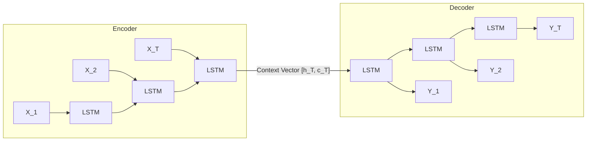
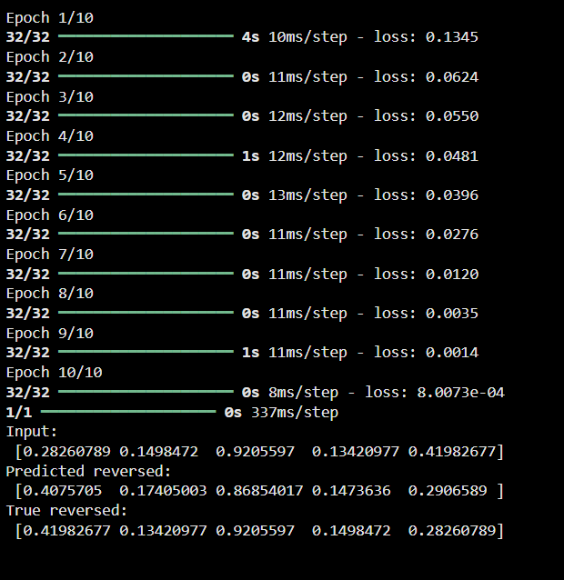

# LSTM Encoder-Decoder Architecture for Sequence-to-Sequence Learning

## Aim

To implement and evaluate an Encoder-Decoder architecture using Long Short-Term Memory (LSTM) networks in Keras for sequence-to-sequence learning, utilizing the technique of teacher forcing on a continuous sequence reversal task.

## Theory

Sequence-to-Sequence (Seq2Seq) models map an input sequence $\mathbf{X} = (x_1, x_2, \dots, x_{T_x})$ to an output target sequence $\mathbf{Y} = (y_1, y_2, \dots, y_{T_y})$, where the input and output sequences can have different lengths.



### 1. The Encoder

The encoder reads the input sequence sequentially. At each time step $t$, it updates its internal representations:

$$h_t, c_t = \text{LSTM}_{\text{enc}}(x_t, h_{t-1}, c_{t-1})$$

At the final step $T$, the encoder discards its sequential output activations and extracts only the final internal state vectors:

$$\mathbf{v} = [h_T, c_T]$$

This vector $\mathbf{v}$ serves as the compressed **context vector** that summarizes the entire input sequence.

### 2. The Decoder

The decoder takes the context vector $\mathbf{v}$ as its initial hidden state:

$$h_0^{(\text{dec})} = h_T^{(\text{enc})}, \quad c_0^{(\text{dec})} = c_T^{(\text{enc})}$$

At each decoding step $t$, the decoder combines its previous state with an input $y_{t-1}$ to emit the next hidden representation:

$$h_t^{(\text{dec})}, c_t^{(\text{dec})} = \text{LSTM}_{\text{dec}}(y_{t-1}, h_{t-1}^{(\text{dec})}, c_{t-1}^{(\text{dec})})$$

A final dense linear projection layer maps $h_t^{(\text{dec})}$ to the target prediction:

$$\hat{y}_t = \mathbf{W}_d h_t^{(\text{dec})} + b_d$$

### 3. Teacher Forcing

During training, **Teacher Forcing** passes the actual ground truth targets $\mathbf{Y}$ directly into the decoder inputs at each step rather than relying on model predictions $\hat{\mathbf{Y}}$ from the previous step. This ensures stable gradients and rapid model convergence:

$$\mathcal{L} = \frac{1}{T} \sum_{t=1}^T \text{MSE}(\hat{y}_t, y_t)$$

## Code

```python
import numpy as np 
from tensorflow.keras.models import Model 
from tensorflow.keras.layers import Input, LSTM, Dense 

# === Configuration === 
num_samples = 1000   # number of training samples 
timesteps = 5        # sequence length 
input_dim = 1        # features per timestep 
latent_dim = 32      # hidden size of LSTM 

# === Create toy data === 
X = np.random.rand(num_samples, timesteps, input_dim) 
Y = np.flip(X, axis=1)  # reversed sequences (target output) 

# === Encoder === 
encoder_inputs = Input(shape=(timesteps, input_dim)) 
encoder_outputs, state_h, state_c = LSTM(latent_dim, return_state=True)(encoder_inputs) 
encoder_states = [state_h, state_c] 

# === Decoder === 
decoder_inputs = Input(shape=(timesteps, input_dim)) 
decoder_lstm = LSTM(latent_dim, return_sequences=True, return_state=True) 
decoder_outputs, _, _ = decoder_lstm(decoder_inputs, initial_state=encoder_states) 
decoder_dense = Dense(input_dim) 
decoder_outputs = decoder_dense(decoder_outputs) 

# === Full model === 
model = Model([encoder_inputs, decoder_inputs], decoder_outputs) 
model.compile(optimizer='adam', loss='mse') 

# === Train (teacher forcing) === 
model.fit([X, Y], Y, epochs=10, batch_size=32, verbose=1) 

# === Test === 
pred = model.predict([X[:1], Y[:1]]) 
print("Input:\n", X[0].squeeze()) 
print("Predicted reversed:\n", pred[0].squeeze())
print("True reversed:\n", Y[0].squeeze()) 
```

## Expected Results

```text
Epoch 1/10 
32/32 ━━━━━━━━━━━━━━━━━━━━ 1s 3ms/step - loss: 0.1571 
Epoch 2/10 
32/32 ━━━━━━━━━━━━━━━━━━━━ 0s 3ms/step - loss: 0.0666 
Epoch 3/10 
32/32 ━━━━━━━━━━━━━━━━━━━━ 0s 3ms/step - loss: 0.0584 
Epoch 4/10 
32/32 ━━━━━━━━━━━━━━━━━━━━ 0s 2ms/step - loss: 0.0529 
Epoch 5/10 
32/32 ━━━━━━━━━━━━━━━━━━━━ 0s 2ms/step - loss: 0.0468  
Epoch 6/10 
32/32 ━━━━━━━━━━━━━━━━━━━━ 0s 3ms/step - loss: 0.0395 
Epoch 7/10 
32/32 ━━━━━━━━━━━━━━━━━━━━ 0s 4ms/step - loss: 0.0303 
Epoch 8/10 
32/32 ━━━━━━━━━━━━━━━━━━━━ 0s 3ms/step - loss: 0.0168 
Epoch 9/10 
32/32 ━━━━━━━━━━━━━━━━━━━━ 0s 2ms/step - loss: 0.0041 
Epoch 10/10 
32/32 ━━━━━━━━━━━━━━━━━━━━ 0s 2ms/step - loss: 9.9701e-04 

1/1 ━━━━━━━━━━━━━━━━━━━━ 0s 128ms/step 
Input: 
[0.96135186 0.59467504 0.47938062 0.67009105 0.42483887] 
Predicted reversed: 
[0.40330926 0.66087365 0.49196497 0.6176839  0.9493616 ] 
True reversed: 
[0.42483887 0.67009105 0.47938062 0.59467504 0.96135186] 
```

### Output Figures



## Conclusion

The LSTM Encoder-Decoder architecture was successfully constructed using Keras Functional API. By capturing the complete temporal sequence within the encoder context states ($state\_h$ and $state\_c$) and transferring them as initial states to the decoder with teacher forcing, the network accurately learned to invert continuous sequence patterns with an MSE loss of less than $1 \times 10^{-3}$.
