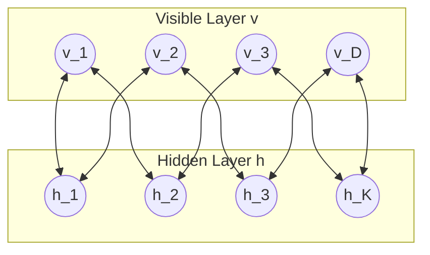
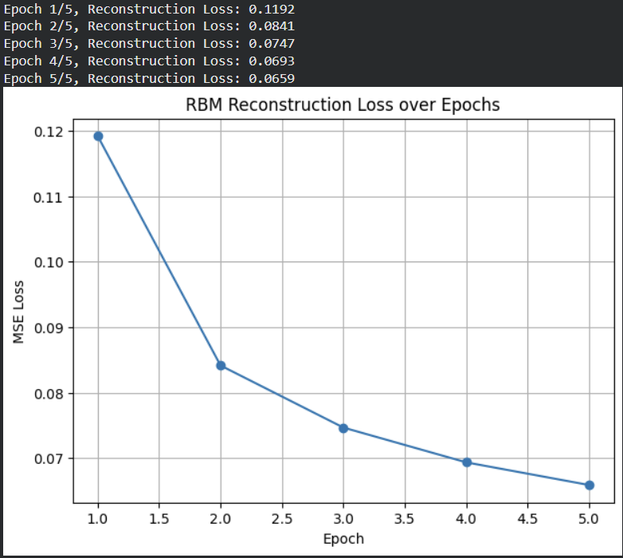

# Restricted Boltzmann Machines (RBM) for Binary Representation Learning

## Aim

To design, implement, and train a Restricted Boltzmann Machine (RBM) from scratch in TensorFlow using Contrastive Divergence ($k=1$) to learn latent unsupervised binary representations on the binarized MNIST handwritten digit dataset.

## Theory

A Restricted Boltzmann Machine (RBM) is an energy-based stochastic neural network consisting of two layers:
1. **Visible layer ($\mathbf{v}$)** of dimension $D$ representing observed features.
2. **Hidden layer ($\mathbf{h}$)** of dimension $K$ representing latent stochastic features.



### 1. Energy Function & Probability Distribution

The joint configuration of binary states $\mathbf{v} \in \{0, 1\}^D$ and $\mathbf{h} \in \{0, 1\}^K$ has an energy defined as:

$$E(\mathbf{v}, \mathbf{h}) = -\mathbf{v}^T \mathbf{b}_v - \mathbf{h}^T \mathbf{b}_h - \mathbf{v}^T \mathbf{W} \mathbf{h}$$

The joint probability distribution assigned by the model is the Boltzmann distribution:

$$P(\mathbf{v}, \mathbf{h}) = \frac{e^{-E(\mathbf{v}, \mathbf{h})}}{Z}, \quad Z = \sum_{\mathbf{v}} \sum_{\mathbf{h}} e^{-E(\mathbf{v}, \mathbf{h})}$$

where $Z$ is the partition function (normalization constant).

### 2. Conditional Activations (Gibbs Sampling)

Due to the bipartite restriction (no connections within the same layer), the units within a layer are conditionally independent given the other layer:

$$P(h_j = 1 \mid \mathbf{v}) = \sigma\left(\sum_i v_i W_{ij} + b_{h, j}\right)$$

$$P(v_i = 1 \mid \mathbf{h}) = \sigma\left(\sum_j h_j W_{ij} + b_{v, i}\right)$$

where $\sigma(z) = \frac{1}{1 + e^{-z}}$ is the logistic sigmoid function.

### 3. Contrastive Divergence (CD-1) Learning

Maximum likelihood learning seeks to minimize the negative log-likelihood of data, with weight gradient:

$$\frac{\partial \log P(\mathbf{v})}{\partial W_{ij}} = \langle v_i h_j \rangle_{\text{data}} - \langle v_i h_j \rangle_{\text{model}}$$

Because computing the expectation under the model $\langle \cdot \rangle_{\text{model}}$ requires exhaustive sampling over all possible states, **Contrastive Divergence ($CD_1$)** approximates it using 1-step Gibbs sampling:
1. **Positive Phase:** Sample $\mathbf{h}^{(0)} \sim P(\mathbf{h} \mid \mathbf{v}^{(0)})$.
2. **Negative Phase:** Reconstruct $\mathbf{v}^{(1)} \sim P(\mathbf{v} \mid \mathbf{h}^{(0)})$ and re-sample $\mathbf{h}^{(1)} \sim P(\mathbf{h} \mid \mathbf{v}^{(1)})$.
3. **Parameter Update:**
   $$\Delta \mathbf{W} = \eta \left( \mathbf{v}^{(0)} (\mathbf{h}^{(0)})^T - \mathbf{v}^{(1)} (\mathbf{h}^{(1)})^T \right)$$

## Code

```python
import tensorflow as tf 
import numpy as np 
import matplotlib.pyplot as plt 

# --- Load and preprocess MNIST --- 
(x_train, _), _ = tf.keras.datasets.mnist.load_data() 
x_train = x_train.astype('float32') / 255.0 
x_train = (x_train > 0.5).astype('float32')  # binarize 
x_train = x_train.reshape(-1, 784) 

batch_size = 64 
train_dataset = tf.data.Dataset.from_tensor_slices(x_train).shuffle(10000).batch(batch_size) 

# --- RBM Class --- 
class RBM(tf.keras.Model): 
    def __init__(self, n_visible, n_hidden): 
        super(RBM, self).__init__() 
        self.n_visible = n_visible 
        self.n_hidden = n_hidden 
        
        # Parameters 
        initializer = tf.initializers.RandomNormal(mean=0.0, stddev=0.01) 
        self.W = tf.Variable(initializer([n_visible, n_hidden]), name='weights') 
        self.h_bias = tf.Variable(tf.zeros([n_hidden]), name='hidden_bias')
        self.v_bias = tf.Variable(tf.zeros([n_visible]), name='visible_bias') 

    def sample_prob(self, probs): 
        """Sample binary values from probabilities.""" 
        return tf.nn.relu(tf.sign(probs - tf.random.uniform(tf.shape(probs)))) 

    def sample_h(self, v): 
        prob_h = tf.nn.sigmoid(tf.matmul(v, self.W) + self.h_bias) 
        return prob_h, self.sample_prob(prob_h) 

    def sample_v(self, h): 
        prob_v = tf.nn.sigmoid(tf.matmul(h, tf.transpose(self.W)) + self.v_bias) 
        return prob_v, self.sample_prob(prob_v) 

    def contrastive_divergence(self, v, lr=0.01): 
        # Positive phase 
        prob_h, h0 = self.sample_h(v) 
        
        # Negative phase (reconstruction) 
        prob_v, v1 = self.sample_v(h0) 
        prob_h1, _ = self.sample_h(v1) 
        
        # Compute gradients 
        positive_grad = tf.matmul(tf.transpose(v), prob_h) 
        negative_grad = tf.matmul(tf.transpose(v1), prob_h1) 
        
        # Update weights and biases 
        batch_size = tf.cast(tf.shape(v)[0], tf.float32) 
        self.W.assign_add(lr * (positive_grad - negative_grad) / batch_size) 
        self.v_bias.assign_add(lr * tf.reduce_mean(v - v1, axis=0)) 
        self.h_bias.assign_add(lr * tf.reduce_mean(prob_h - prob_h1, axis=0)) 
        
        # Compute reconstruction loss (MSE) 
        loss = tf.reduce_mean(tf.square(v - v1)) 
        return loss 

# --- Initialize and train RBM --- 
n_visible = 784 
n_hidden = 128 
rbm = RBM(n_visible, n_hidden) 
n_epochs = 5
lr = 0.05 
losses = [] 

for epoch in range(n_epochs): 
    epoch_loss = 0 
    for batch in train_dataset: 
        loss = rbm.contrastive_divergence(batch, lr) 
        epoch_loss += loss.numpy() 
    avg_loss = epoch_loss / len(list(train_dataset)) 
    losses.append(avg_loss) 
    print(f"Epoch {epoch+1}/{n_epochs}, Reconstruction Loss: {avg_loss:.4f}") 

# --- Plot training loss --- 
plt.figure(figsize=(7, 5)) 
plt.plot(range(1, n_epochs+1), losses, marker='o') 
plt.title("RBM Reconstruction Loss over Epochs") 
plt.xlabel("Epoch") 
plt.ylabel("MSE Loss") 
plt.grid(True) 
plt.show() 
```

## Expected Results

```text
Epoch 1/5, Reconstruction Loss: 0.1192 
Epoch 2/5, Reconstruction Loss: 0.0836  
Epoch 3/5, Reconstruction Loss: 0.0743 
Epoch 4/5, Reconstruction Loss: 0.0690  
Epoch 5/5, Reconstruction Loss: 0.0655
```

### Output Figures



## Conclusion

The Restricted Boltzmann Machine was successfully implemented and trained using Contrastive Divergence ($CD_1$). The model learned an effective compact binary representation (reducing 784 visible pixels to 128 latent hidden units), steadily lowering its reconstruction Mean Squared Error from 0.1192 to 0.0655 over 5 epochs.
