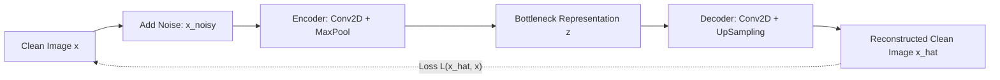
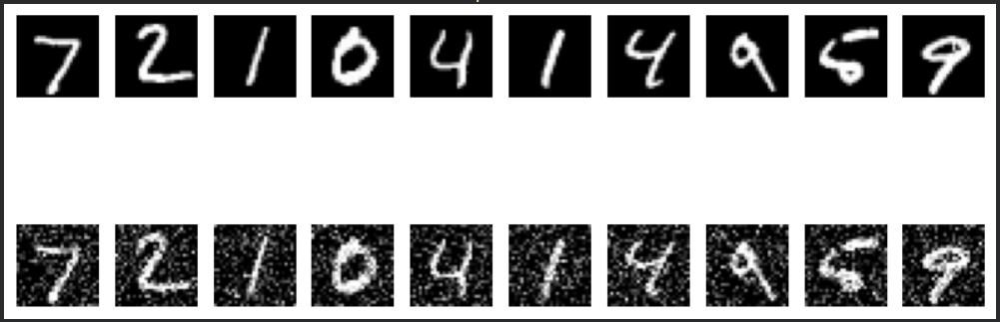
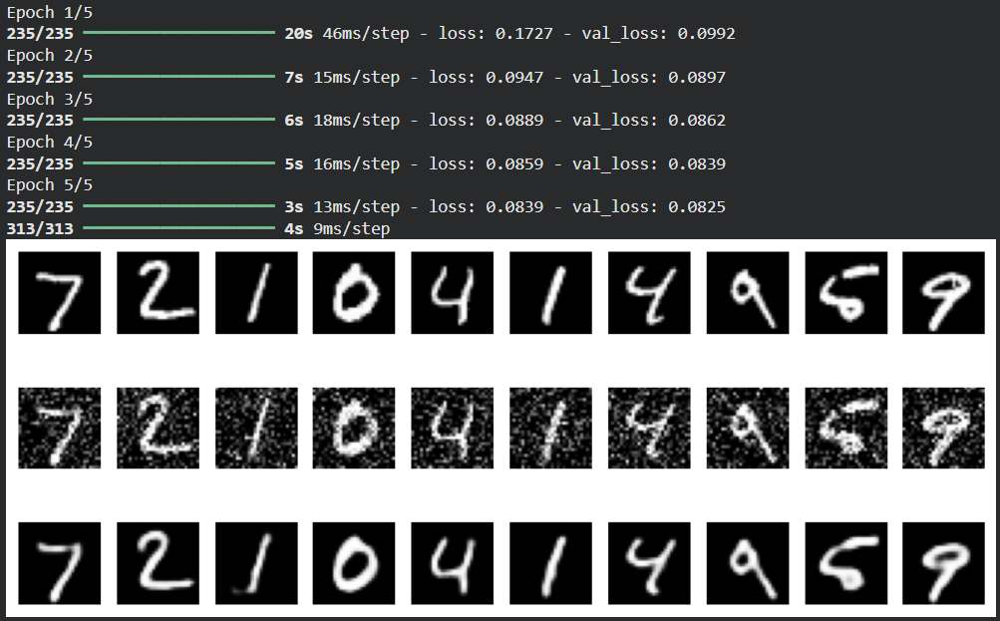

# Convolutional Denoising Autoencoder for Image Reconstruction

## Aim

To design, build, and train a Convolutional Denoising Autoencoder in TensorFlow/Keras to remove stochastic Gaussian noise from corrupted MNIST handwritten digits and reconstruct high-fidelity clean images.

## Theory

An autoencoder is a neural network designed to reproduce its input. To prevent trivial identity learning, a **Denoising Autoencoder (DAE)** introduces stochastic noise into the inputs while requiring the network to recover the uncorrupted originals.



### 1. Corruption Process

Given a clean normalized image $\mathbf{x} \in [0, 1]^D$, synthetic Gaussian noise is added:

$$\tilde{\mathbf{x}} = \text{clip}\left(\mathbf{x} + \alpha \cdot \boldsymbol{\epsilon}, \, 0, \, 1\right), \quad \boldsymbol{\epsilon} \sim \mathcal{N}(\mathbf{0}, \mathbf{I})$$

where $\alpha = 0.3$ is the noise standard deviation.

### 2. Encoder-Decoder Network Topology

- **Encoder $f_\theta$:** Compresses noisy input $\tilde{\mathbf{x}}$ into lower-dimensional spatial representations using convolutional filters and $2 \times 2$ max pooling:

$$\mathbf{z} = f_\theta(\tilde{\mathbf{x}})$$

- **Decoder $g_\phi$:** Expands the latent feature maps back to original dimensions $(28 \times 28 \times 1)$ using $2 \times 2$ upsampling followed by convolutions and a final sigmoid activation:

$$\hat{\mathbf{x}} = g_\phi(\mathbf{z})$$

### 3. Reconstruction Objective

The network minimizes pixel-wise binary cross-entropy between the reconstructed output $\hat{\mathbf{x}}$ and the clean ground truth $\mathbf{x}$:

$$\mathcal{L}(\mathbf{x}, \hat{\mathbf{x}}) = -\frac{1}{N} \sum_{i=1}^N \left[ x_i \log(\hat{x}_i) + (1 - x_i) \log(1 - \hat{x}_i) \right]$$

By training on $(\tilde{\mathbf{x}}, \mathbf{x})$ pairs, the network learns an orthogonal projection that projects points off the data manifold back onto the clean data manifold.

## Code

```python
import tensorflow as tf 
from tensorflow.keras import layers, models 
import numpy as np 
import matplotlib.pyplot as plt 

# Load and normalize MNIST dataset 
(x_train, _), (x_test, _) = tf.keras.datasets.mnist.load_data() 
x_train, x_test = x_train / 255.0, x_test / 255.0 
x_train, x_test = np.expand_dims(x_train, -1), np.expand_dims(x_test, -1)

# Add random noise 
x_train_noisy = np.clip(x_train + 0.3 * np.random.normal(0, 1, x_train.shape), 0, 1) 
x_test_noisy = np.clip(x_test + 0.3 * np.random.normal(0, 1, x_test.shape), 0, 1) 

# Visualize clean vs noisy images 
plt.figure(figsize=(10, 4)) 
for i in range(10): 
    plt.subplot(2, 10, i + 1)
    plt.imshow(x_test[i].squeeze(), cmap='gray')
    plt.axis('off') 
    plt.subplot(2, 10, i + 11)
    plt.imshow(x_test_noisy[i].squeeze(), cmap='gray')
    plt.axis('off') 
plt.show() 

# Build autoencoder 
autoencoder = models.Sequential([ 
    layers.Conv2D(32, (3, 3), activation='relu', padding='same', input_shape=(28, 28, 1)), 
    layers.MaxPooling2D((2, 2), padding='same'), 
    layers.Conv2D(64, (3, 3), activation='relu', padding='same'), 
    layers.MaxPooling2D((2, 2), padding='same'), 
    layers.Conv2D(64, (3, 3), activation='relu', padding='same'), 
    layers.UpSampling2D((2, 2)), 
    layers.Conv2D(32, (3, 3), activation='relu', padding='same'), 
    layers.UpSampling2D((2, 2)), 
    layers.Conv2D(1, (3, 3), activation='sigmoid', padding='same') 
]) 

autoencoder.compile(optimizer='adam', loss='binary_crossentropy') 
autoencoder.fit(
    x_train_noisy, 
    x_train, 
    epochs=5, 
    batch_size=256, 
    validation_data=(x_test_noisy, x_test)
) 

# Predict and visualize denoised images 
decoded = autoencoder.predict(x_test_noisy) 

plt.figure(figsize=(10, 4)) 
for i in range(10): 
    plt.subplot(3, 10, i + 1)
    plt.imshow(x_test[i].squeeze(), cmap='gray')
    plt.axis('off') 
    plt.subplot(3, 10, i + 11)
    plt.imshow(x_test_noisy[i].squeeze(), cmap='gray')
    plt.axis('off') 
    plt.subplot(3, 10, i + 21)
    plt.imshow(decoded[i].squeeze(), cmap='gray')
    plt.axis('off') 
plt.show() 
```

## Expected Results

```text
Epoch 1/5 
235/235 ━━━━━━━━━━━━━━━━━━━━ 9s 33ms/step - loss: 0.1703 - val_loss: 0.0994 
Epoch 2/5 
235/235 ━━━━━━━━━━━━━━━━━━━━ 8s 32ms/step - loss: 0.0950 - val_loss: 0.0897 
Epoch 3/5 
235/235 ━━━━━━━━━━━━━━━━━━━━ 8s 32ms/step - loss: 0.0889 - val_loss: 0.0861 
Epoch 4/5 
235/235 ━━━━━━━━━━━━━━━━━━━━ 7s 32ms/step - loss: 0.0859 - val_loss: 0.0841 
Epoch 5/5 
235/235 ━━━━━━━━━━━━━━━━━━━━ 8s 32ms/step - loss: 0.0842 - val_loss: 0.0826 
313/313 ━━━━━━━━━━━━━━━━━━━━ 1s 3ms/step 
```

### Output Figures





## Conclusion

The Convolutional Denoising Autoencoder effectively removed severe Gaussian corruption ($\sigma=0.3$) from handwritten digits. By forcing the latent feature bottleneck to discard uncorrelated random noise and retain robust spatial geometric features, the model converged to a low validation binary cross-entropy loss of 0.0826, recovering clean digits with high visual clarity.
