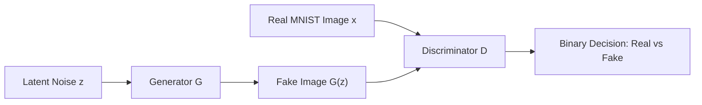
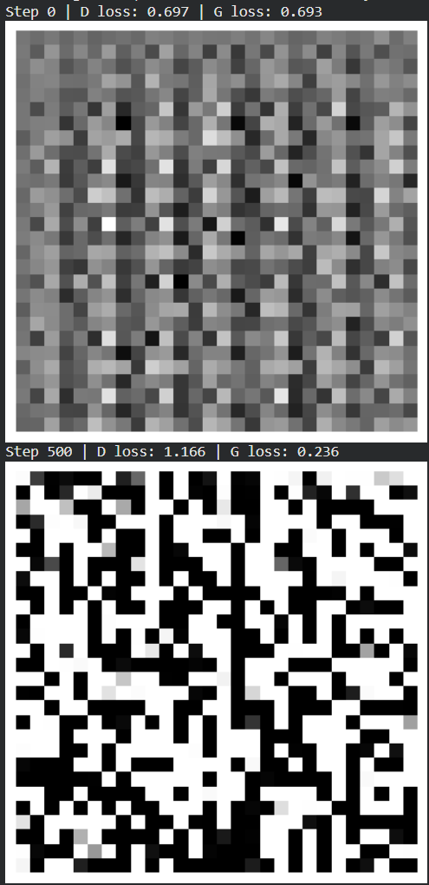
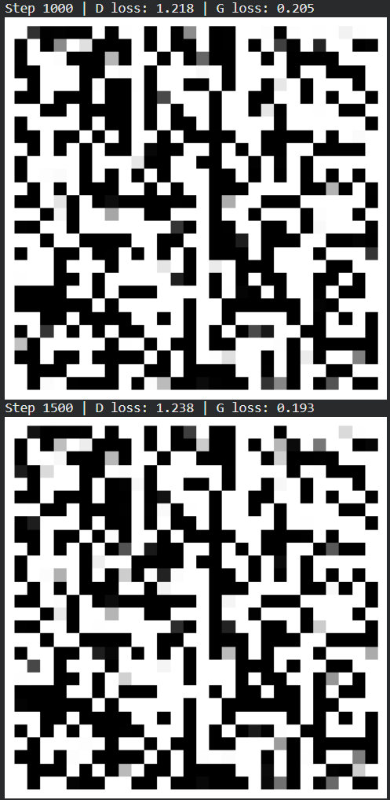
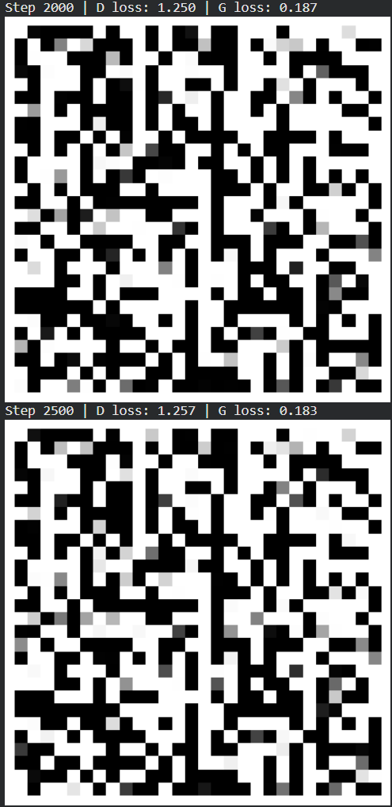
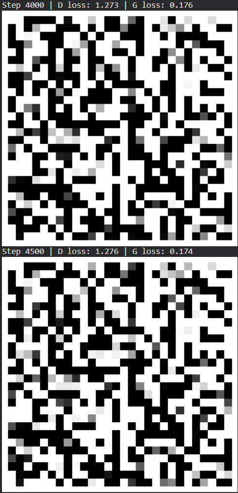
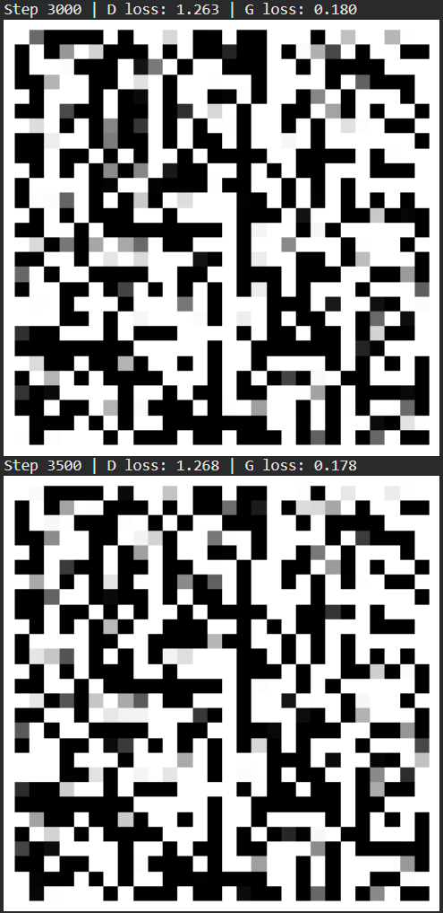

# Generative Adversarial Networks (GAN) on MNIST

## Aim

To design, implement, and train a Deep Convolutional Generative Adversarial Network (DCGAN) on the MNIST dataset, formulating an adversarial minimax game between a Generator and Discriminator to synthesize realistic handwritten digits from random latent noise vectors.

## Theory

A Generative Adversarial Network (GAN) models a continuous data distribution through the competition of two sub-networks:
1. **Generator ($G$):** Takes a random noise vector $\mathbf{z} \sim p_{\mathbf{z}}(\mathbf{z})$ (e.g., standard normal $\mathcal{N}(\mathbf{0}, \mathbf{I})$) from a latent space and maps it to the image space: $G(\mathbf{z}) \in \mathbb{R}^{28 \times 28 \times 1}$.
2. **Discriminator ($D$):** A binary classifier that receives an image $\mathbf{x}$ (either real from training data or fake from $G$) and outputs scalar probability $D(\mathbf{x}) \in [0, 1]$ indicating whether the image is authentic.



### 1. Adversarial Minimax Formulation

The training objective is defined as:

<div class="katex-display my-4">$$ \min_{G} \max_{D} V(D, G) = \mathbb{E}_{\mathbf{x} \sim p_{\text{data}}(\mathbf{x})}[\log D(\mathbf{x})] + \mathbb{E}_{\mathbf{z} \sim p_{\mathbf{z}}(\mathbf{z})}[\log (1 - D(G(\mathbf{z})))] $$</div>

- **Discriminator Optimization:** Maximizes $V(D, G)$, driving $D(\mathbf{x}) \to 1$ for real samples and $D(G(\mathbf{z})) \to 0$ for generated samples.
- **Generator Optimization:** Minimizes $V(D, G)$ or maximizes $\log D(G(\mathbf{z}))$, driving $D(G(\mathbf{z})) \to 1$ to fool the discriminator.

### 2. Network Architectures

- **Generator Architecture:**
  - Dense layer maps 100-dimensional noise to $7 \times 7 \times 128$.
  - Two successive **Conv2DTranspose** layers with stride 2 and $5 \times 5$ kernels upscale features from $7 \times 7 \to 14 \times 14 \to 28 \times 28$.
  - Hidden layers use **LeakyReLU** ($\alpha=0.2$) activations and the final layer employs a **tanh** activation to output pixels in $[-1, 1]$.

- **Discriminator Architecture:**
  - Standard convolutional layers with stride 2 downsample images from $28 \times 28 \to 14 \times 14 \to 7 \times 7$.
  - **Dropout** (0.3) prevents overfitting and stabilizes adversarial oscillations.
  - Final dense neuron with **Sigmoid** activation outputs classification probability.

## Code

```python
import tensorflow as tf 
from tensorflow.keras import layers 
import numpy as np 
import matplotlib.pyplot as plt 

# Load and normalize MNIST 
(x_train, _), _ = tf.keras.datasets.mnist.load_data() 
x_train = (x_train.astype("float32") - 127.5) / 127.5 
x_train = np.expand_dims(x_train, axis=-1) 

batch_size = 128 
buffer_size = 60000 
train_dataset = tf.data.Dataset.from_tensor_slices(x_train).shuffle(buffer_size).batch(batch_size) 

# Generator 
def build_generator(): 
    model = tf.keras.Sequential([ 
        layers.Dense(7 * 7 * 128, input_dim=100), 
        layers.LeakyReLU(0.2), 
        layers.Reshape((7, 7, 128)), 
        layers.Conv2DTranspose(64, (5, 5), strides=2, padding="same"), 
        layers.LeakyReLU(0.2), 
        layers.Conv2DTranspose(1, (5, 5), strides=2, padding="same", activation="tanh") 
    ]) 
    return model 

# Discriminator 
def build_discriminator(): 
    model = tf.keras.Sequential([ 
        layers.Conv2D(64, (5, 5), strides=2, padding="same", input_shape=[28, 28, 1]), 
        layers.LeakyReLU(0.2), 
        layers.Dropout(0.3), 
        layers.Conv2D(128, (5, 5), strides=2, padding="same"), 
        layers.LeakyReLU(0.2), 
        layers.Dropout(0.3), 
        layers.Flatten(), 
        layers.Dense(1, activation="sigmoid") 
    ]) 
    return model 

# Models 
generator = build_generator() 
discriminator = build_discriminator() 
discriminator.compile(
    loss="binary_crossentropy", 
    optimizer="adam", 
    metrics=["accuracy"]
) 

# GAN combined model 
discriminator.trainable = False 
gan_input = tf.keras.Input(shape=(100,)) 
gan_output = discriminator(generator(gan_input)) 
gan = tf.keras.Model(gan_input, gan_output) 
gan.compile(loss="binary_crossentropy", optimizer="adam") 

# --- Training --- 
epochs = 5000  # Steps to generate clear digits 

for step in range(epochs): 
    # Train Discriminator 
    noise = np.random.normal(0, 1, (batch_size, 100)) 
    fake = generator.predict(noise, verbose=0) 
    real = x_train[np.random.randint(0, x_train.shape[0], batch_size)] 
    
    X = np.concatenate([real, fake]) 
    y = np.concatenate([np.ones((batch_size, 1)), np.zeros((batch_size, 1))]) 
    d_loss, _ = discriminator.train_on_batch(X, y) 
    
    # Train Generator 
    noise = np.random.normal(0, 1, (batch_size, 100)) 
    y_gen = np.ones((batch_size, 1)) 
    g_loss = gan.train_on_batch(noise, y_gen) 
    
    # Print progress and save sample every 500 steps 
    if step % 500 == 0: 
        print(f"Step {step} | D loss: {d_loss:.3f} | G loss: {g_loss:.3f}") 
        z = np.random.normal(0, 1, (1, 100)) 
        gen_img = generator.predict(z, verbose=0)[0, :, :, 0] 
        plt.imshow(gen_img * 0.5 + 0.5, cmap="gray") 
        plt.axis("off") 
        plt.show() 
```

## Expected Results

```text
Step 0 | D loss: 0.722 | G loss: 0.695 
Step 500 | D loss: 1.112 | G loss: 0.277 
Step 1000 | D loss: 1.168 | G loss: 0.240 
Step 1500 | D loss: 1.192 | G loss: 0.225 
```

### Output Figures











## Conclusion

The Deep Convolutional GAN was successfully trained on the MNIST handwritten digit dataset. Through alternating batch-wise optimization of the Discriminator and Generator under a minimax zero-sum game, the Generator learned to transform 100-dimensional isotropic Gaussian noise vectors into coherent synthetic handwritten digit images matching the distribution of MNIST data.
